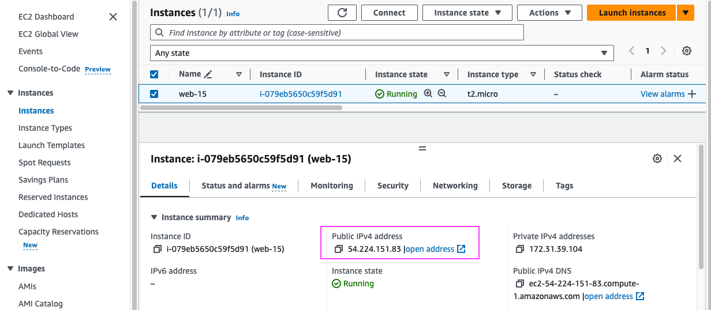
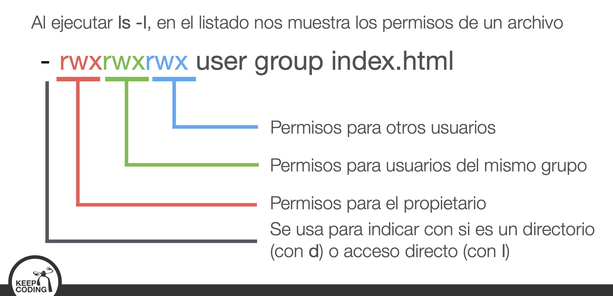
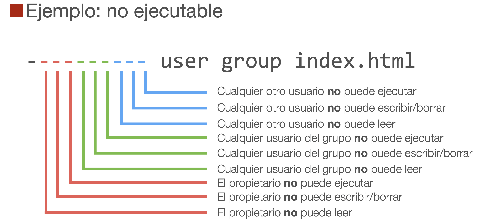

## AWS

Iniciamos con el video **1.mp4**

---

**trucos**

* `Ctrl+r` : es un buscador de comandos antiguos, has de decirle las palabras que quieres buscar
* `sudo !!` : cuando te olvidas poner sudo en el comando, esto te permite ejecutar ell mismo comando que antes con sudo delante



```sh
Despliegue_AWS ls
    web15.pem

# usuario de acceso con ip
Despliegue_AWS ssh ubuntu@54.224.151.83
    "The authenticity of host '54.224.151.83 (54.224.151.83)' can't be established.
    ED25519 key fingerprint is SHA256:18BE2tcCHLs3H3pAK3aRXblKUhQ56RXbHu8KKBVN/ZM.
    This key is not known by any other names.
    Are you sure you want to continue connecting (yes/no/[fingerprint])? yes
    Warning: Permanently added '54.224.151.83' (ED25519) to the list of known hosts.
    ubuntu@54.224.151.83: Permission denied (publickey)."

# se ha guardado laprimera vez esta huella: SHA256:18BE2tcCHLs3H3pAK3aRXblKUhQ56RXbHu8KKBVN/ZM
Despliegue_AWS ssh ubuntu@54.224.151.83
    ubuntu@54.224.151.83: Permission denied (publickey).

Despliegue_AWS ssh -i web15.pem ubuntu@54.224.151.83
    @@@@@@@@@@@@@@@@@@@@@@@@@@@@@@@@@@@@@@@@@@@@@@@@@@@@@@@@@@@
    @         WARNING: UNPROTECTED PRIVATE KEY FILE!          @
    @@@@@@@@@@@@@@@@@@@@@@@@@@@@@@@@@@@@@@@@@@@@@@@@@@@@@@@@@@@
    Permissions 0644 for 'web15.pem' are too open.
    It is required that your private key files are NOT accessible by others.
    This private key will be ignored.
    Load key "web15.pem": bad permissions
    ubuntu@54.224.151.83: Permission denied (publickey).

# protejemos el archivo
Despliegue_AWS chmod 600 web15.pem 

    Welcome to Ubuntu 22.04.3 LTS (GNU/Linux 6.2.0-1017-aws x86_64)

    * Documentation:  https://help.ubuntu.com
    * Management:     https://landscape.canonical.com
    * Support:        https://ubuntu.com/advantage

    System information as of Tue Feb  6 14:30:07 UTC 2024

    System load:  0.00146484375     Processes:             95
    Usage of /:   20.5% of 7.57GB   Users logged in:       0
    Memory usage: 21%               IPv4 address for eth0: 172.31.39.104
    Swap usage:   0%

    Expanded Security Maintenance for Applications is not enabled.

    0 updates can be applied immediately.

    Enable ESM Apps to receive additional future security updates.
    See https://ubuntu.com/esm or run: sudo pro status


    The list of available updates is more than a week old.
    To check for new updates run: sudo apt update


    The programs included with the Ubuntu system are free software;
    the exact distribution terms for each program are described in the
    individual files in /usr/share/doc/*/copyright.

    Ubuntu comes with ABSOLUTELY NO WARRANTY, to the extent permitted by
    applicable law.

    To run a command as administrator (user "root"), use "sudo <command>".
    See "man sudo_root" for details.

ubuntu@ip-172-31-39-104:~$ 

# para cerrar --> ubuntu@ip-172-31-39-104:~$ logout 
```

```sh
ubuntu@ip-172-31-39-104:~$ pwd
    /home/ubuntu

# ¿quien está conecta al servidor?
ubuntu@ip-172-31-39-104:~$ who
ubuntu   pts/0        2024-02-06 14:30 (77.243.86.2)

# creo archivo hello
ubuntu@ip-172-31-39-104:~$ touch hello
ubuntu@ip-172-31-39-104:~$ ls
    hello

# los archivos ocultos en formato lista
ubuntu@ip-172-31-39-104:~$ ls -l /
    total 64
    lrwxrwxrwx   1 root root     7 Dec  7 02:10 bin -> usr/bin
    drwxr-xr-x   4 root root  4096 Dec  7 02:15 boot
    drwxr-xr-x  15 root root  3200 Feb  6 12:31 dev
    drwxr-xr-x  93 root root  4096 Feb  6 12:31 etc
    drwxr-xr-x   3 root root  4096 Feb  6 12:31 home
    lrwxrwxrwx   1 root root     7 Dec  7 02:10 lib -> usr/lib
    lrwxrwxrwx   1 root root     9 Dec  7 02:10 lib32 -> usr/lib32
    lrwxrwxrwx   1 root root     9 Dec  7 02:10 lib64 -> usr/lib64
    lrwxrwxrwx   1 root root    10 Dec  7 02:10 libx32 -> usr/libx32
    drwx------   2 root root 16384 Dec  7 02:13 lost+found
    drwxr-xr-x   2 root root  4096 Dec  7 02:10 media
    drwxr-xr-x   2 root root  4096 Dec  7 02:10 mnt
    drwxr-xr-x   2 root root  4096 Dec  7 02:10 opt
    dr-xr-xr-x 158 root root     0 Feb  6 12:31 proc
    drwx------   4 root root  4096 Feb  6 12:31 root
    drwxr-xr-x  25 root root   860 Feb  6 14:30 run
    lrwxrwxrwx   1 root root     8 Dec  7 02:10 sbin -> usr/sbin
    drwxr-xr-x   8 root root  4096 Dec  7 02:17 snap
    drwxr-xr-x   2 root root  4096 Dec  7 02:10 srv
    dr-xr-xr-x  13 root root     0 Feb  6 12:31 sys
    drwxrwxrwt  11 root root  4096 Feb  6 12:32 tmp
    drwxr-xr-x  14 root root  4096 Dec  7 02:10 usr
    drwxr-xr-x  13 root root  4096 Dec  7 02:13 var

ubuntu@ip-172-31-39-104:~$ pwd
/home/ubuntu

ubuntu@ip-172-31-39-104:~$ cd ..
ubuntu@ip-172-31-39-104:/home$ ls
    ubuntu
ubuntu@ip-172-31-39-104:/home$ ls -l /
    total 64
    lrwxrwxrwx   1 root root     7 Dec  7 02:10 bin -> usr/bin
    drwxr-xr-x   4 root root  4096 Dec  7 02:15 boot
    drwxr-xr-x  15 root root  3200 Feb  6 12:31 dev
    drwxr-xr-x  93 root root  4096 Feb  6 12:31 etc
    drwxr-xr-x   3 root root  4096 Feb  6 12:31 home
    lrwxrwxrwx   1 root root     7 Dec  7 02:10 lib -> usr/lib
    lrwxrwxrwx   1 root root     9 Dec  7 02:10 lib32 -> usr/lib32
    lrwxrwxrwx   1 root root     9 Dec  7 02:10 lib64 -> usr/lib64
    lrwxrwxrwx   1 root root    10 Dec  7 02:10 libx32 -> usr/libx32
    drwx------   2 root root 16384 Dec  7 02:13 lost+found
    drwxr-xr-x   2 root root  4096 Dec  7 02:10 media
    drwxr-xr-x   2 root root  4096 Dec  7 02:10 mnt
    drwxr-xr-x   2 root root  4096 Dec  7 02:10 opt
    dr-xr-xr-x 155 root root     0 Feb  6 12:31 proc
    drwx------   4 root root  4096 Feb  6 12:31 root
    drwxr-xr-x  25 root root   860 Feb  6 14:30 run
    lrwxrwxrwx   1 root root     8 Dec  7 02:10 sbin -> usr/sbin
    drwxr-xr-x   8 root root  4096 Dec  7 02:17 snap
    drwxr-xr-x   2 root root  4096 Dec  7 02:10 srv
    dr-xr-xr-x  13 root root     0 Feb  6 12:31 sys
    drwxrwxrwt  11 root root  4096 Feb  6 12:32 tmp
    drwxr-xr-x  14 root root  4096 Dec  7 02:10 usr
    drwxr-xr-x  13 root root  4096 Dec  7 02:13 var
```

**SISTEMA DE FICHEROS**

* **/etc** : ficheros de configuración del sistema
* **/etc/init.d/** : Scripts que se ejecutan cuando arranca el sistema en
* **/etc/rc.d/** : Scripts que se ejecutan cuando arranca el sistema en
* **/home y /rooT** : ficheros de configuración del sistema
  - **/home/goku** : usuario del sistema
  - **/home/vegeta** : usuario del sistem
* **/root** : es la casa de root (superadministrador)
* **/sbin** : ejecutables de comandos  --> los programas
* **/tmp** : almacenar datos, serán eliminados cuando el sistema se reinicio o necesite espacio
* **/usr/bin**: ejecutables para cualquier usuario
* **/usr/lib**: librerías de programación (C/C++ habitualmente)
* **/usr/local**: archivos locales (desarrollados por ti)
* **/usr/sbin**: ejecutables sólo para administradores
* **/usr/share**: datos compartidos (documentación)
* **/usr/src**: código fuente del kernel de Linux
* **/var/log**: archivos de log
* **/var/mail**: buzones de e-mail de los usuarios
* **/var/run**: descriptores de procesos o sockets
* **/var/www**: archivos servidos por el servidor web

**JUGANDO CON ARCHIVOS Y DIRECTORIOSs**

* **mkdir `<foldername>`** : Crear un directorio
* **rmdir `<foldername>`** : Elimina recursivamente directorios y archivos.
* **rm -rf `<foldername>`** : PELIGRO: rm -rf / como root borraría todo el disco 
* **touch `<filename>`** : Crear un archivo vacío
* **nano `<filename>`** : Editar un archivo
* **vi `<filename>`**: Editar un archivo
* **cat `<filename>`** : Muestra el contenido de un fichero (ideal para archivos pequeños)
* **more `<filename>`** : Permite leer un fichero grande poco a poco
* **head `<filename>`** : Muestra las primeras líneas del fichero
* **tail `<filename>`** : Muestra las últimas líneas del fichero
* **tail -f `<filename>`** : Muestra en tiempo real el último contenido del fichero
* **wc `<filename>`** : Cuántas palabras tiene un archivo de texto
* **wc -l `<filename>`** : Cuántas líneas tiene un archivo de texto
* **diff `<file1> <file2>`** : Muestra las diferencias entre dos archivos
* **sort `<filename>`** : Ordena las líneas de un archivo de texto
* **grep `<filename> <query>`** : Filtra contenidos. Busca <query> en <filename>. Permite expresiones regulares.
* **cp `<source> <target>`** : Copia un archivo de un sitio a otro
* **mv `<source> <target>`** : Mueve o renombra un archivo
* **rm `<filename>`** : Eliminar un archivo
* **rm -f `<filename>`** : Para que no pregunte si estamos seguros de eliminar
* **ln `<source> <target>`** : Crea un alias del archivo. Si eliminamos el alias se elimina el archivo.
* **ln -s `<source> <target>`** : Crea un acceso directo. Si eliminamos el acceso directo, NO elimina el archivo. También conocido como enlace simbólico.

---

https://www.tecmint.com/35-practical-examples-of-linux-find-command/

* **find . -name `<filename>`** : Busca un archivo de nombre filename en el directorio actual y subdirectorios.
* **find / -name `<filename>`** : Busca un archivo de nombre filename en todo el sistema
* **man `<command name>`** : Muestra el manual del programa o comando

**USUARIOS GRUPOS Y PERMISOS**

**Usuarios y grupos**

* Linux es un sistema multiusuario
* Los usuarios no sólo son personas, también pueden ser servicios
(como el servidor web, servidor de correo, etc.)
* Las cuentas de usuario, pueden pertenecer a uno o varios grupos
* Hay unos grupos especiales de administrador (admin o sudo)
* Suele haber una cuenta de super-administrador: root
* En Ubuntu, el login con root está deshabilitado por seguridad

**Permisos de archivos**

* Cada archivo o carpeta pertenece a un usuario y un grupo
* Los permisos de Linux permiten definir tres tipos de acceso:
   - Lectura
   - Escritura y/o borrado
   - Ejecución (para archivos o scripts ejecutables)
* Estos tres tipos de acceso, se definen en tres niveles:
   - Propietario del archivo o carpeta
   - Usuarios del mismo grupo del archivo o carpeta
   - Otros usuarios fuera del grupo





**Modificar permisos de archivos y carpeta**

* **chmod `<target>`±rwx `<filename>`**
    - `<target>` = a / u / g / o
    - a = all / u = user/owner / g = group / o = other
* **chmod u+wrx backup** : Da (+) todos (rwx) los permisos para el propietario (u)
* **chmod a+x backup** : Da (+) permisos de ejecución (x) para todos (a)
* **chmod g+rx backup**: Da (+) permisos de lectura y ejecución (rx) a los usuarios del grupo (g)
* **chmod o-rw backup**: Quita (-) permisos de lectura y escritura (rw) a los otros usuarios (o)

* **adduser <username>** : Crear un usuario y un grupo con el mismo nombre del usuario y mete al usuario en dicho grupo. Esto lo registra en /etc/passwd y /etc/group


**Ejecutando como administrador**

* **sudo `<command>`** : Ejecuta lo que viene seguido de sudo como administrador. El usuario debe tener permiso de sudoer.
* **deluser `<username>`** : Elimina un usuario del sistema. Lo elimina de /etc/passwd
* **addgroup `<groupname>`** : Crea un grupo añadiéndolo a /etc/group
* **delgroup `<groupname>`** : Elimina un grupo de /etc/group No elimina los usuarios de ese grupo
* **adduser `<username> <groupname>`** : Añade el usuario al grupo en /etc/group
* **adduser `<username>` sudo** : Añade el usuario al grupo sudo en /etc/group Si eres sudo, tienes permisos para todo, da igual los permisos del archivo
* **chown `<newowner> <filename>`** : El archivo <filename> pasa a pertenecer a <newowner>
* **chown -R `<newowner> <foldername>** : Cambiar el propietario de <foldername> y todos sus archivos y subdirectorios. Es un cambio recursivo (-R)
* **chgrp `<newgroup> <filename>`** : El archivo <filename> pasa a pertenecer a <newgroup>
* **chgrp -R `<newgroup> <foldername>`** : Cambiar el grupo de <foldername> y todos sus archivos y subdirectorios. Es un cambio recursivo (-R)
* **chown `<user>:<group> <filename>`** : Cambiar el propietario y grupo a la vez
* **passwd `<username>`** : Cambiar contraseña de un usuario


**Apagar y reiniciar** En necesario que seas administrador o sudoer

* **shutdown** :  Apaga el servidor
* **reboot** : Reiniciar el servidor


**Instalando y desinstalando software**

Gestor de paquetes `apt-get`

En las distribuciones basadas en Debian (como Ubuntu), se puede instalar y desinstalar software a través del gestor de paquetes:`apt-get`
Este gestor se descarga paquetes ya compilados desde Internet para tu distribución y los instala en el sistema (descargando también otras dependencias si hiciera falta).

* **apt-get install `<package>`** : Instala el paquete `<package>` en el sistema
* **apt-get purge `<package>`** : Desinstala el paquete `<package>` del sistema
* **apt-get update** : Actualiza los repositorios de software para buscar actualizaciones
* **apt-get upgrade** : Instala todas las actualizaciones de paquetes


**Gestión de procesos**


* **top** [top: el CTRL+ALT+SUPR de Linux] : Muestra en tiempo real información de los los procesos ordenados por consumo de CPU (de mayor a menor). Para salir, pulsar la letra Q (de quit)
* **ps aux** : Muestra todos los procesos en ejecución con mucha información (no sólo los que más CPU consumen, com hace top)
* **ps aux | more** : Para poder ir viéndolos poco a poco
* **ps aux | grep `<command>`** : Para buscar un processo <command>
* **kill `<pid>`** : Mata el proceso número <pid>. Sólo vale para procesos nuestros.
* **sudo kill `<pid>`** : Para poder matar procesos de otros usuarios


**Gestionando el espacio en disco**

* **df** : Muestra el espacio libre de las particiones en bytes
* **df -h** : Muestra el espacio libre legible para humanos (h)
* **du `<folder>`** : Muestra lo que ocupa cada archivo dentro de `<folder>`
* **du -ch `<folder>`** : Más rápido (c) y entendible para humanos (h)


**Seguridad**

Consejos de seguridad

* Cambiar las contraseñas como mucho trimestralmente
* Cambia los puertos por defecto de los servicios que puedas
* Oculta los números de versión de los servicios
* Protege con SSL y autenticación HTTP los accesos de
administración de tus plataformas
* No uses /admin /adm /cms /backend /backoffice (sé original)
* Usa un firewall
* Haz copias de seguridad diarias...y haz ensayos de recuperación
* Mantén actualizado tu software
* Elimina los humanos: son la mayor brecha de seguridad


`fail2ban`

* Es un servicio que se encarga de proteger el sistema sobre ataques a diferentes servicios mediante monitorización de los logs (entre otros aspectos).
* Cuando detecta una amenaza, reacciona baneando la IP del posible atacante.
* A veces se pasa de protector y nos deja sin acceso a nosotros
* Es muy sencillo de configurar

Instalación `fail2ban`

```sh
sudo apt-get install fail2ban
```

* **`/etc/fail2ban/jail.conf`** : Fichero de configuración
* **`/etc/fail2ban/filter.d/`** : Configuración de filtros y acciones


**Comprimir y descomprimir**

Hay varias opciones, pero lo más habitual es usar tar + gzip:

* tar es un comando que empaqueta (junta varias carpetas en un archivo) pero no comprime
* gzip es un comando que comprime archivos (similar a zip)
* Se utiliza tar con la opción -z para comprimir en gzip
* También podemos usar zip, pero en Linux se usa mas .tar.gz

* **tar -czvf `<foo>`.tar.gz `<folder>`** : Comprime el directrorio <folder> en un archivo <foo>.tar.gz
* **tar -xzvf `<foo>`.tar.gz** : Descomprime <foo>.tar.gz en el directorio local
* **zip -r `<foo>`.zip `<folder>`** : Comprime el directrorio <folder> en un archivo <foo>.zip ACHTUNG: zip no suele venir instalado en Linux.
* **unzip <foo>.zip** : Descomprime el archivo <foo>.zip en el directorio actual. ACHTUNG: unzip no suele venir instalado en Linux.


**Redirección** 


En Bash podemos redirigir la salida de los comandos para que, en lugar de mostrarnos el resultado por pantalla, nos lo almacenen en un fichero. También podemos redirigir la entrada, para que un comando en lugar de esperar un dato por pantalla (o teclado) directamente lo tome de un fichero.


* **echo “hi” > hello.txt** : Guarda la salida del comando “echo” en el fichero “hello.txt”. Si el fichero existe, machaca su contenido.
Si no existe el fichero, lo crea.
* **echo “hi” >> hello.txt** : Igual que el anterior, pero: Si el fichero existe, añade el contenido al final. Si no existe el fichero, lo crea.
* **patch index.js < v1.patch** : Pasa el contenido de “hello.txt” como argumento al comando hello.


**Pipes**

Los pipes nos permiten pasar la información de un comando a otro como si fueran filtros. La salida de un comando se transforma en la entrada de otro comando.

* `cat quixote.txt | grep Rocinante | wc -l` : cat saca todo el contenido del fichero “quixote.txt” y se lo pasa como entrada al comando “grep Rocinante” que filtrará las líneas en las que aparece la palabra “Rocinante” y éste le pasa dicho resultado al comando “more” que nos permite ir leyendo poco a poco los resultados.


> [!NOTE]
> Repositorio de comandos:  http://www.commandlinefu.com/


## Scripting

* La bash permite almacenar comandos en un fichero de texto y ejecutarlos como si fuera programas.
* Proporciona incluso instrucciones de control de flujo y bucles
* Los ficheros deben tener permisos de ejecución para poder ser
tratados como programas.
* En la primera línea, se ha de indicar cuál es el intérprete que se
debe utilizar.
* Podemos utilizar otros lenguajes de scripting (python, php, perl...)

```sh
#!/bin/bash
# This is a comment
echo “My command is called $0\n” echo “The first argument is $1\n” for item in ‘$(ls)’
do
echo “- $item\n” done
```

```sh
#!/bin/bash para scripts bash o shellscript 
#!/bin/python para scripts python 
#!/bin/php para scripts php
```

**Variables implícitas** 

* **$@** lista de parámetros recibida por el comando
* **$0** nombre del propio comando/archivo
* **$1** primer parámetro
* **$2** segundo parámetro
...
* **$n** n-ésimo parámetro
* **`$?`** resultado de la salida del último comando (0 es OK, !=0 es KO) $$ número de proceso que se ejecuta
* **$#** número de parámetros recibidos por el comando


```sh
# Definición de variables
name=“hello” 
counter=0
```

```sh
# Uso de variables
echo “Hello $name” 
echo “Hello ${name}” 
echo “$counter times” 
echo “${counter} times”
```

```sh
# Usando la salida de un comando
files=$(ls) # Ejecuta el comando ls y guarda su salida en “files” 
echo $files
```


```sh
# Condicionales

if <condition> then
<stuff>
else
<otherstuff>
fi
```


```sh
# Condiciones de las condicionales

if cp $source $target # si se ejecuta bien cp
if test -f $source # si $source es un fichero
if [ -f “$source” ] # si $source es un fichero
if [ -d “$source” ] # si $source es un directorio if [ -e “$source” ] # si $source existe
if $source = $target # si $source es igual a $target
if $source != $target # si $source es distinto a $target
```

```sh
# Condiciones de las condicionales: numéricas

if $numA -eq $numB # $numA == $numB 
if $numA -ne $numB # $numA != $numB 
if $numA -ge $numB # $numA >= $numB 
if $numA -gt $numB # $numA > $numB 
if $numA -le $numB # $numA <= $numB 
if $numA -lt $numB # $numA < $numB
```

```sh
# Case

case <variable> in <value1>)
<stuff>
;;
<value2> | <value3>)
<otherstuff>
;; *)
;; esac
```

```sh
# Bucle for

for file in $(ls) 
do
    <stuff>
done
```

**Salida**

Cuando nuestro programa acaba bien, debe devolver `exit 0`. Si algo va mal, deberemos devolver un número distinto de cero (lo suyo es diferenciar los tipos de error con números).

```sh
# Funciones

function <name> ()
{
    <commands>
    return <int>
}
```


**Ejecutar en background**

* **`<command>` &** : Ejecutar en background sin deconexión

ACHTUNG: No vale para ejecutar en segundo plano y desconectarnos. El sistema puede matar el proceso pasado un tiempo.

* **nohup `<command>` &** : Ejecutar en background con desconexión. La posible salida que pueda sacar el comando, la almacenará en un archivo llamado nohup.out


**Programando tareas automáticas**


El cron

* Todos los sistemas Linux incluyen un programador de tareas: cron
* Nos permite programar comandos que se ejecuten automáticamente
* Básicamente, se almacena en un fichero la información de programación y el comando a ejecutar
* Como máximo podemos ejecutar repetitivamente hasta una vez por minuto


**Programando tareas para mi usuario**

* **crontab -e** : 


* **sudo nano /etc/crontab** : Programando tareas de sistema


**Ejemplo crontab -e**

* `30 10 * * 1 /usr/bin/who >> /home/who.txt` : Todos los lunes a las 10:30
* `0,30 * * * 1 /usr/bin/who >> /home/who.txt`: Todos los lunes a en punto o a y media de todas las horas
* `*/15 * * * * /usr/bin/who >> /home/who.txt` : Cada 15 minutos
* `30 21 * * 6 /sbin/shutdown -h now` : Apaga el servidor los sábados a las 21:30. Sólo lo podría hacer root.

https://es.wikipedia.org/wiki/Cron_(Unix)

**Ejemplo /etc/crontab** 


* `30 10 * * 1 larry /usr/bin/who >> /home/who.txt` : Todos los lunes a las 10:30
* `0,30 * * * 1 steve /usr/bin/who >> /home/who.txt` : Todos los lunes a en punto o a y media de todas las horas
* `*/15 * * * * sergei /usr/bin/who >> /home/who.txt` : Cada 15 minutos
* `30 21 * * 6 root /sbin/shutdown -h now` : Apaga el servidor los sábados a las 21:30. Sólo lo podría hacer root.

# NGINX

El todo en uno : servidor web, proxy invers y balanceador de carga.

NGINX es un software de servidor web de alto rendimiento, conocido por su estabilidad, rico conjunto de características, configuración simple, y bajo consumo de recursos. Originalmente diseñado para servir contenido estático de manera eficiente, NGINX se ha expandido para ofrecer una solución de red completa, incluyendo capacidades de proxy inverso, proxy de correo electrónico (IMAP/POP3), y un balanceador de carga.

**Servidor Web**

Como servidor web, NGINX es conocido por su habilidad para manejar un gran número de conexiones simultáneas con un bajo uso de memoria y CPU. Esto lo hace ideal para sitios web con mucho tráfico y para servir archivos estáticos (como imágenes, CSS, y JavaScript), donde supera a otros servidores web como Apache en términos de eficiencia y velocidad.

**Proxy Inverso**

En su función de proxy inverso, NGINX actúa como intermediario para solicitudes de clientes, reenviándolas a servidores internos. Esto puede ser usado para distribuir la carga entre varios servidores, mejorar la seguridad ocultando la verdadera ubicación de los servidores internos, manejar el cifrado SSL/TLS, y servir contenido dinámico y estático de manera eficiente.

**Balanceador de Carga**

NGINX puede distribuir el tráfico entrante entre varios servidores traseros basándose en diferentes métodos de balanceo de carga, como round-robin, menos conexiones, y hash de IP. Esto mejora la disponibilidad y la redundancia de las aplicaciones web, permitiendo que los sitios web manejen volúmenes de tráfico más altos y proporcionen tiempos de respuesta más rápidos.

**Características Adicionales**

Alto rendimiento y manejo eficiente de conexiones: NGINX utiliza un modelo de eventos asincrónicos para manejar múltiples conexiones, lo que le permite manejar miles de conexiones simultáneas en una máquina con hardware modesto.

Configuración flexible: La configuración de NGINX es conocida por su potencia y flexibilidad, permitiendo a los usuarios ajustar el servidor para optimizar el rendimiento y la seguridad.

* Soporte para WebSocket: NGINX soporta el protocolo WebSocket, permitiendo aplicaciones web en tiempo real.

* Cifrado SSL/TLS: NGINX puede manejar la terminación SSL/TLS, descriptografía de solicitudes antes de pasarlas a los servidores de aplicación internos, y cifrando las respuestas antes de enviarlas a los clientes, mejorando así la seguridad.

* Caching: NGINX puede almacenar en caché contenido dinámico y estático, reduciendo la carga en los servidores de aplicación y mejorando el tiempo de respuesta para los usuarios finales.

Compresión: Reduce el tamaño de los datos enviados a los clientes, mejorando los tiempos de carga de las páginas.

**Uso**

NGINX se utiliza en una variedad de entornos, desde sitios web personales hasta algunas de las mayores propiedades de internet. Empresas como Netflix, Airbnb, y Dropbox usan NGINX para servir contenido de manera eficiente a millones de usuarios diariamente. Su capacidad para manejar un gran número de conexiones simultáneas con un uso eficiente de recursos lo hace ideal para sitios web de alto tráfico, aplicaciones web en tiempo real, y como parte de la infraestructura de microservicios.

```sh
➜  ~ sudo apt-get install nginx
```


```sh
# Conectando con AWS

➜  DESPLIEGUE cd Despliegue_AWS 
➜  Despliegue_AWS ssh -i web15.pem ubuntu@54.224.151.83
    Welcome to Ubuntu 22.04.3 LTS (GNU/Linux 6.2.0-1017-aws x86_64)

    * Documentation:  https://help.ubuntu.com
    * Management:     https://landscape.canonical.com
    * Support:        https://ubuntu.com/advantage

    System information as of Wed Feb  7 13:03:41 UTC 2024

    System load:  0.0               Processes:             98
    Usage of /:   30.3% of 7.57GB   Users logged in:       0
    Memory usage: 24%               IPv4 address for eth0: 172.31.39.104
    Swap usage:   0%

    * Ubuntu Pro delivers the most comprehensive open source security and
    compliance features.

    https://ubuntu.com/aws/pro

    Expanded Security Maintenance for Applications is not enabled.

    25 updates can be applied immediately.
    To see these additional updates run: apt list --upgradable

    Enable ESM Apps to receive additional future security updates.
    See https://ubuntu.com/esm or run: sudo pro status


    *** System restart required ***
    Last login: Tue Feb  6 14:30:09 2024 from 77.243.86.2
    To run a command as administrator (user "root"), use "sudo <command>".
    See "man sudo_root" for details.

ubuntu@ip-172-31-39-104:~$ 

# instalando nginx
ubuntu@ip-172-31-39-104:~$ sudo apt-get install nginx
```

Te está diciendo que reinicará todos estos archivos, le das al tabulador para irte al ok y le das.

Ahora vamos a reinicar desde la consola de aws


o desde la consola 

> [!IMPORTANT]
> Acuerdate que antes de hacer esto en produccion deberías hacer una foto, `Snapshot` desde aws

```sh
# reinicio
ubuntu@ip-172-31-39-104:~$ sudo reboot

# vuelvo a conectar con el kernel nuevo
ubuntu@ip-172-31-39-104:~$ Connection to 54.224.151.83 closed by remote host.
Connection to 54.224.151.83 closed.
➜  Despliegue_AWS ssh -i web15.pem ubuntu@54.224.151.83
    Welcome to Ubuntu 22.04.3 LTS (GNU/Linux 6.2.0-1018-aws x86_64)

    * Documentation:  https://help.ubuntu.com
    * Management:     https://landscape.canonical.com
    * Support:        https://ubuntu.com/advantage

    System information as of Wed Feb  7 13:03:41 UTC 2024

    System load:  0.0               Processes:             98
    Usage of /:   30.3% of 7.57GB   Users logged in:       0
    Memory usage: 24%               IPv4 address for eth0: 172.31.39.104
    Swap usage:   0%

    * Ubuntu Pro delivers the most comprehensive open source security and
    compliance features.

    https://ubuntu.com/aws/pro

    Expanded Security Maintenance for Applications is not enabled.

    25 updates can be applied immediately.
    To see these additional updates run: apt list --upgradable

    Enable ESM Apps to receive additional future security updates.
    See https://ubuntu.com/esm or run: sudo pro status


    Last login: Wed Feb  7 13:03:41 2024 from 77.243.86.7
ubuntu@ip-172-31-39-104:~$ 
```

Hemos de configurar el cortafuegos


---


---

Incluimos el puerto de acceso HTTP con dns 0.0.0.0. para que pueda acceder todo el mundo, si quieres puedes decirle que solo puede acceder una direccion particular.


---

Ahora si te vas al browser y navegas a la ip que te ha dado antes

```sh
http://54.224.151.83/
```

verás que entras en `Welcome to nginx!`

```json
Welcome to nginx!  
Si ve esta página, el servidor web nginx se instaló correctamente y funciona. 
Se requiere configuración adicional.
```


```sh
# paro el servidor nginx
sudo systemctl stop nginx

# arranco del nuevo
sudo systemctl start nginx

# puedes ver los procesos abiertos
ubuntu@ip-172-31-39-104:~$ ps aux | grep nginx

root         424  0.0  0.2  55224  2284 ?        Ss   13:21   0:00 nginx: master process /usr/sbin/nginx -g daemon on; master_process on;
www-data     428  0.0  0.6  55856  6124 ?        S    13:21   0:00 nginx: worker process
ubuntu       796  0.0  0.2   7008  2304 pts/0    S+   13:51   0:00 grep --color=auto nginx
ubuntu@ip-172-31-39-104:~$ 

```

```sh
# recargar sin que deje de funcionar el servidor
sudo systemctl reload nginx

# permite comprobar si lo que has escrito de configuracion no la has cagado
sudo nginx-t
```

**configuracino**

* El fichero de configuracion está en `etc/nginx/nginx.conf`
* En `etc/nginx/nginx.conf` podemos incluir configuracion personalizada que sobreescriba parámetros por defecto (si no queremos tocar `etc/nginx/nginx.conf`)

```sh
# leamos el fichero de configuracion
ubuntu@ip-172-31-39-104:~$ less /etc/nginx/nginx.conf

    user www-data;
    worker_processes auto;
    pid /run/nginx.pid;
    include /etc/nginx/modules-enabled/*.conf;

    events {
            worker_connections 768;
            # multi_accept on;
    }

    http {

            ##
            # Basic Settings
            ##

            sendfile on;
            tcp_nopush on;
            types_hash_max_size 2048;
            # server_tokens off;

            # server_names_hash_bucket_size 64;
            # server_name_in_redirect off;

            include /etc/nginx/mime.types;
            default_type application/octet-stream;

            ##
            # SSL Settings
            ##

            ssl_protocols TLSv1 TLSv1.1 TLSv1.2 TLSv1.3; # Dropping SSLv3, ref: POODLE
            ssl_prefer_server_ciphers on;

            ##
            # Logging Settings
            ##

            access_log /var/log/nginx/access.log;
            error_log /var/log/nginx/error.log;

            ##
            # Gzip Settings
            ##

            gzip on;

            # gzip_vary on;
            # gzip_proxied any;
            # gzip_comp_level 6;
            # gzip_buffers 16 8k;
            # gzip_http_version 1.1;
            # gzip_types text/plain text/css application/json application/javascript text/xml application/xml application/xml+rss text/javascript;

            ##
            # Virtual Host Configs
            ##

            include /etc/nginx/conf.d/*.conf;
            include /etc/nginx/sites-enabled/*;
    }

```

**Configuración de nuestros sitios web**

* Con una sola instalación, podemos dar servicio a varios dominios o subdominios.
* En `/etc/nginx/site-available/` podemos incluir congifuracion de otros sitios que queramos configurar.
* Una vez configurados, debemos hacer un **acceso directo** (ln -s) el archivo a `/etc/nginx/sites-enabled/` para que nginx los sirva


```sh
# veamos todos los archivos de configuracion de nginx
ubuntu@ip-172-31-39-104:~$ cd /etc/nginx/
ubuntu@ip-172-31-39-104:/etc/nginx$ ls -l

total 64
drwxr-xr-x 2 root root 4096 May 30  2023 conf.d
-rw-r--r-- 1 root root 1125 May 30  2023 fastcgi.conf
-rw-r--r-- 1 root root 1055 May 30  2023 fastcgi_params
-rw-r--r-- 1 root root 2837 May 30  2023 koi-utf
-rw-r--r-- 1 root root 2223 May 30  2023 koi-win
-rw-r--r-- 1 root root 3957 May 30  2023 mime.types
drwxr-xr-x 2 root root 4096 May 30  2023 modules-available
drwxr-xr-x 2 root root 4096 Feb  7 13:07 modules-enabled
-rw-r--r-- 1 root root 1447 May 30  2023 nginx.conf
-rw-r--r-- 1 root root  180 May 30  2023 proxy_params
-rw-r--r-- 1 root root  636 May 30  2023 scgi_params
drwxr-xr-x 2 root root 4096 Feb  7 13:07 sites-available
drwxr-xr-x 2 root root 4096 Feb  7 13:07 sites-enabled
drwxr-xr-x 2 root root 4096 Feb  7 13:07 snippets
-rw-r--r-- 1 root root  664 May 30  2023 uwsgi_params
-rw-r--r-- 1 root root 3071 May 30  2023 win-utf
```

```sh
ubuntu@ip-172-31-39-104:/etc/nginx$ cd sites-enabled/
ubuntu@ip-172-31-39-104:/etc/nginx/sites-enabled$ ls -l
total 0
lrwxrwxrwx 1 root root 34 Feb  7 13:07 default -> /etc/nginx/sites-available/default
ubuntu@ip-172-31-39-104:/etc/nginx/sites-enabled$ 
```

esto es un link `lrwxrwxrwx 1 root root 34 Feb  7 13:07 default -> /etc/nginx/sites-available/default` directo al archivo `sites-available`

```sh
# miramos que hay dentro
ubuntu@ip-172-31-39-104:/etc/nginx/sites-enabled$ less default

server {
        listen 80 default_server;
        listen [::]:80 default_server;

        # SSL configuration
        #
        # listen 443 ssl default_server;
        # listen [::]:443 ssl default_server;
        #
        # Note: You should disable gzip for SSL traffic.
        # See: https://bugs.debian.org/773332
        #
        # Read up on ssl_ciphers to ensure a secure configuration.
        # See: https://bugs.debian.org/765782
        #
        # Self signed certs generated by the ssl-cert package
        # Don't use them in a production server!
        #
        # include snippets/snakeoil.conf;

        root /var/www/html; # <----- FIJATE EL DIRECTORI A LA RAIZ

        # Add index.php to the list if you are using PHP
        index index.html index.htm index.nginx-debian.html;

        server_name _;

        location / {
                # First attempt to serve request as file, then
                # as directory, then fall back to displaying a 404.
                try_files $uri $uri/ =404;
        }

        # pass PHP scripts to FastCGI server
        #
        #location ~ \.php$ {
        #       include snippets/fastcgi-php.conf;
        #
        #       # With php-fpm (or other unix sockets):
        #       fastcgi_pass unix:/run/php/php7.4-fpm.sock;
        #       # With php-cgi (or other tcp sockets):
        #       fastcgi_pass 127.0.0.1:9000;
        #}

        # deny access to .htaccess files, if Apache's document root
        # concurs with nginx's one
        #
        #location ~ /\.ht {
        #       deny all;
        #}
}


# Virtual Host configuration for example.com
#
# You can move that to a different file under sites-available/ and symlink that
# to sites-enabled/ to enable it.
#
#server {
#       listen 80;
#       listen [::]:80;
#
#       server_name example.com;
#
#       root /var/www/example.com;
#       index index.html;
#
#       location / {
#               try_files $uri $uri/ =404;
#       }
#}
(END)
```

Fíjate lo que te ha dicho

```sh
        root /var/www/html; # <----- FIJATE EL DIRECTORI A LA RAIZ

        # Add index.php to the list if you are using PHP
        index index.html index.htm index.nginx-debian.html;
```


La página de inicio que te muestra 

```json
Welcome to nginx!  
Si ve esta página, el servidor web nginx se instaló correctamente y funciona. 
Se requiere configuración adicional.
```

Te la muetra porque aquí `/var/www/html` debe haber algo

```sh
# miremos que hay dentro 
ubuntu@ip-172-31-39-104:/etc/nginx/sites-enabled$ cd /var/www/html
ubuntu@ip-172-31-39-104:/var/www/html$ ls 
index.nginx-debian.html
ubuntu@ip-172-31-39-104:/var/www/html$ cat index.nginx-debian.html 

    <!DOCTYPE html>
    <html>
    <head>
    <title>Welcome to nginx!</title>
    <style>
        body {
            width: 35em;
            margin: 0 auto;
            font-family: Tahoma, Verdana, Arial, sans-serif;
        }
    </style>
    </head>
    <body>
    <h1>Welcome to nginx!</h1>
    <p>If you see this page, the nginx web server is successfully installed and
    working. Further configuration is required.</p>

    <p>For online documentation and support please refer to
    <a href="http://nginx.org/">nginx.org</a>.<br/>
    Commercial support is available at
    <a href="http://nginx.com/">nginx.com</a>.</p>

    <p><em>Thank you for using nginx.</em></p>
    </body>
    </html>
```
 Es esta página

 
```json
Welcome to nginx!  
Si ve esta página, el servidor web nginx se instaló correctamente y funciona. 
Se requiere configuración adicional.
```

Como en las instrucciones del fichero nginx te decía que si no sabías que fichero ver, busca : `index index.html | index.htm | index.nginx-debian.html;`

por esto está cargando este archivo 

```sh
ubuntu@ip-172-31-39-104:/var/www/html$ ls -l
total 4
-rw-r--r-- 1 root root 612 Feb  7 13:07 index.nginx-debian.html
```

Vamos a ver el arhivo

```sh
ubuntu@ip-172-31-39-104:/var/www/html$ ls -l
    total 4
    -rw-r--r-- 1 root root 612 Feb  7 13:07 index.nginx-debian.html
ubuntu@ip-172-31-39-104:/var/www/html$ ls -l /var/www/
    total 4
    drwxr-xr-x 2 root root 4096 Feb  7 13:07 html

# abrimos el archivo
ubuntu@ip-172-31-39-104:/var/www/html$ sudo nano index.html
```

El archivo está vacío

pero lo escribimos un **hola mundo** y guardamos


Vamos a https://startbootstrap.com/
copiamos una plantilla

Abro nuevo consola en mi terminal local

```sh
➜  ~ cd /Users/alex/Desktop/KEEPKODING/Servidores_Despliegue_Aplicaciones/template
➜  template ls -l
total 296
-rw-rw-r--@ 1 alex  staff   2407 Mar 25  2023 401.html
-rw-rw-r--@ 1 alex  staff   2407 Mar 25  2023 404.html
-rw-rw-r--@ 1 alex  staff   2338 Mar 25  2023 500.html
drwxrwxr-x@ 4 alex  staff    128 Mar 25  2023 assets
-rw-rw-r--@ 1 alex  staff  11617 Mar 25  2023 charts.html
drwxrwxr-x@ 3 alex  staff     96 Mar 25  2023 css
-rw-rw-r--@ 1 alex  staff  41881 Mar 25  2023 index.html
drwxrwxr-x@ 4 alex  staff    128 Mar 25  2023 js
-rw-rw-r--@ 1 alex  staff   9559 Mar 25  2023 layout-sidenav-light.html
-rw-rw-r--@ 1 alex  staff   9791 Mar 25  2023 layout-static.html
-rw-rw-r--@ 1 alex  staff   4075 Mar 25  2023 login.html
-rw-rw-r--@ 1 alex  staff   3508 Mar 25  2023 password.html
-rw-rw-r--@ 1 alex  staff   5600 Mar 25  2023 register.html
-rw-rw-r--@ 1 alex  staff  38311 Mar 25  2023 tables.html
```

**¿cual es el origen?**


* ¿cual es el origen? mi carpeta entera --> `scp template`
* ¿cuál es el destimo? el servidor --> `ubuntu@54.224.151.83`
* ¿donde quieres que te deje la carpeta? --> `/home/ubuntu`
* qué contraseña tienes para acceder a ubuntu? --> tu archivo : `-i web15.pen`
* quiero subir de forma recursvo para todo lo que hay dentro : `-r`

```sh
# para cargar
$ scp -r -i ../Despliegue_AWS/web15.pem ../template ubuntu@54.224.151.83:/home/ubuntu


# para descargar sería al revés
```

Ahora si te vas a la termina del aws y buscas la carpeta

```sh
# estas en la carpeta /var/www/html con cd te vas a home
ubuntu@ip-172-31-39-104:/var/www/html$ cd
ubuntu@ip-172-31-39-104:~$ ls -l

    total 4
    -rw-rw-r-- 1 ubuntu ubuntu    0 Feb  6 14:33 hello
    drwxrwxr-x 5 ubuntu ubuntu 4096 Feb  7 15:31 template

ubuntu@ip-172-31-39-104:~$ ls -l template/
    total 160
    -rw-rw-r-- 1 ubuntu ubuntu  2407 Feb  7 15:31 401.html
    -rw-rw-r-- 1 ubuntu ubuntu  2407 Feb  7 15:31 404.html
    -rw-rw-r-- 1 ubuntu ubuntu  2338 Feb  7 15:31 500.html
    drwxrwxr-x 4 ubuntu ubuntu  4096 Feb  7 15:31 assets
    -rw-rw-r-- 1 ubuntu ubuntu 11617 Feb  7 15:31 charts.html
    drwxrwxr-x 2 ubuntu ubuntu  4096 Feb  7 15:31 css
    -rw-rw-r-- 1 ubuntu ubuntu 41881 Feb  7 15:31 index.html
    drwxrwxr-x 2 ubuntu ubuntu  4096 Feb  7 15:31 js
    -rw-rw-r-- 1 ubuntu ubuntu  9559 Feb  7 15:31 layout-sidenav-light.html
    -rw-rw-r-- 1 ubuntu ubuntu  9791 Feb  7 15:31 layout-static.html
    -rw-rw-r-- 1 ubuntu ubuntu  4075 Feb  7 15:31 login.html
    -rw-rw-r-- 1 ubuntu ubuntu  3508 Feb  7 15:31 password.html
    -rw-rw-r-- 1 ubuntu ubuntu  5600 Feb  7 15:31 register.html
    -rw-rw-r-- 1 ubuntu ubuntu 38311 Feb  7 15:31 tables.html
```

Ahora toca moverlo a la capeta **/var/www/html** que en esta carpeta solo puede acceder sudo

* copia de manera recursiva y forzada todos los archivos de template y los pegas en /var/...
```sh
# traslado archivos
ubuntu@ip-172-31-39-104:~$ sudo cp -r template/* /var/www/html

# compruebo
ubuntu@ip-172-31-39-104:~$ ls -l /var/www/html

    total 164
    -rw-r--r-- 1 root root  2407 Feb  7 15:39 401.html
    -rw-r--r-- 1 root root  2407 Feb  7 15:39 404.html
    -rw-r--r-- 1 root root  2338 Feb  7 15:39 500.html
    drwxr-xr-x 4 root root  4096 Feb  7 15:39 assets
    -rw-r--r-- 1 root root 11617 Feb  7 15:39 charts.html
    drwxr-xr-x 2 root root  4096 Feb  7 15:39 css
    -rw-r--r-- 1 root root 41881 Feb  7 15:39 index.html
    -rw-r--r-- 1 root root   612 Feb  7 13:07 index.nginx-debian.html
    drwxr-xr-x 2 root root  4096 Feb  7 15:39 js
    -rw-r--r-- 1 root root  9559 Feb  7 15:39 layout-sidenav-light.html
    -rw-r--r-- 1 root root  9791 Feb  7 15:39 layout-static.html
    -rw-r--r-- 1 root root  4075 Feb  7 15:39 login.html
    -rw-r--r-- 1 root root  3508 Feb  7 15:39 password.html
    -rw-r--r-- 1 root root  5600 Feb  7 15:39 register.html
    -rw-r--r-- 1 root root 38311 Feb  7 15:39 tables.html
```

**Hemos conseguido publicar una web estática vía aws**

Ahora vete al browser y recarga la página `https://54.224.151.83` la verás así `https://startbootstrap.com/template/sb-admin`

---

> [!NOTE] 
> Continuamos con la configuracion de nginx pâra entender como con una configuracion de nginx podemos dar servicio a todos los dominios que queramos , tantos como la capacidad de servidor admita en cuanto a las visitas.

**Vamos a desplegar una aplicacion de React**

Descargamos la librería Redux

https://github.com/mjbuckley/react-redux-todo-app

React sirve para hacer una SPA single page aplication. No hay gran diferencia entre una página hecha en React a una página estática como la que desplegamos el otro día. Lo que pasa es que cuendo usamoe el [Router en React](https://github.com/mjbuckley/react-redux-todo-app) , ahí ya si que tenemos que hacer algo especial.

Vamos a desplegar la típica aplicacion de to do


**Descargamos el código y compilamos la aplicacion de React**

* Clono en local este repositorio https://github.com/mjbuckley/react-redux-todo-app.git

```sh
# clonando proyecto app to do
➜  Servidores_Despliegue_Aplicaciones git clone https://github.com/mjbuckley/react-redux-todo-app.git
    Cloning into 'react-redux-todo-app'...
    remote: Enumerating objects: 320, done.
    remote: Counting objects: 100% (30/30), done.
    remote: Compressing objects: 100% (20/20), done.
    remote: Total 320 (delta 23), reused 10 (delta 10), pack-reused 290
    Receiving objects: 100% (320/320), 1.27 MiB | 3.60 MiB/s, done.
    Resolving deltas: 100% (180/180), done.

➜  Servidores_Despliegue_Aplicaciones ls -l
    total 128
    drwxr-xr-x   7 alex  staff    224 Feb  9 09:40 CLASES
    drwxr-xr-x   3 alex  staff     96 Feb  6 15:21 Despliegue_AWS
    drwxr-xr-x@ 13 alex  staff    416 Feb  9 10:05 FullStack15_Servidores_Despliegue_Aplicaciones
    drwxr-xr-x  11 alex  staff    352 Feb  9 10:24 react-redux-todo-app
    -rw-r--r--@  1 alex  staff  62219 Feb  7 16:02 startbootstrap-sb-admin-gh-pages.zip
    drwxrwxr-x@ 16 alex  staff    512 Mar 25  2023 template

# entramos en la carpeta
➜  Servidores_Despliegue_Aplicaciones cd react-redux-todo-app 

# instalamos dependencias
➜  react-redux-todo-app git:(master) ✗ npm install   

# buscamos el script para compilar ""build": "react-scripts build","
➜  react-redux-todo-app git:(master) ✗ cat package.json
{
  "name": "react-redux-todo-app",
  "version": "0.1.0",
  "private": true,
  "homepage": "https://mjbuckley.github.io/react-redux-todo-app",
  "dependencies": {
    "gh-pages": "^1.2.0",
    "lodash": "^4.17.11",
    "react": "^16.8.6",
    "react-dom": "16.3.3",
    "react-redux": "^5.1.1",
    "react-router-dom": "^4.3.1",
    "react-scripts": "1.1.5",
    "redux": "^3.7.2",
    "uuid": "^3.3.2"
  },
  "scripts": {
    "predeploy": "npm run build",
    "deploy": "gh-pages -d build",
    "start": "react-scripts start",
    "build": "react-scripts build",
    "test": "react-scripts test --env=jsdom",
    "eject": "react-scripts eject"
  },
  "devDependencies": {
    "redux-devtools": "^3.5.0"
  }
}

# ejecuta el script build definido en el archivo package.json   
# compila y empaqueta el código fuente en archivos optimizados para producción
# seguro que te deja la aplicacin en una carpeta /dis o /build
➜  react-redux-todo-app git:(master) ✗ npm run build      

    > react-redux-todo-app@0.1.0 build
    > react-scripts build

    Creating an optimized production build...
    Compiled successfully.

    File sizes after gzip:

    56.71 KB  build/static/js/main.1795c7d6.js
    621 B     build/static/css/main.1af68ee8.css

    The project was built assuming it is hosted at /react-redux-todo-app/.
    You can control this with the homepage field in your package.json.

    The build folder is ready to be deployed.
    To publish it at https://mjbuckley.github.io/react-redux-todo-app, run:

    npm run deploy

    Find out more about deployment here:

    http://bit.ly/2vY88Kr

➜  react-redux-todo-app git:(master) ✗ 
```

--- 

Lo que acabamos de hacer para construir la aplicacion de react es lo mismo que haríamos si lo hiciéramos con VSC. Es decir, abrimos la carpeta clonada desde VSC y veremos el archivo `packaje.json` que dentro tenemos el `script` para construir la aplicacion react y lo ejecutamos `npm run build `

```json
  "scripts": {
    "predeploy": "npm run build",
    "deploy": "gh-pages -d build",
    "start": "react-scripts start",
    "build": "react-scripts build",
    "test": "react-scripts test --env=jsdom",
    "eject": "react-scripts eject"
  },
```

Te ha construido una carpeta `build`


---

> [!IMPORTANT]
> Truco impresionanteque hace poco que funciona

---

Creo archivo `.devcontainer.json` 

`.devcontainer.json`

```js
{
    "image": "node:latest"
}
```

Hacer esto te permite que el entorno de desarrollo sea consistente y reproducible, independientemente del sistema operativo o de la configuración de la máquina host. Es decir, estas desarrollando dentro de un contenedor de Docker. Si tu aplicación luego se va a ejecutar dentro de un contenedor de Docker, tu podrías utilizar una imagen de Docker sobre la que se va a subir al servidor; es decir, desarrollar en el mismo entorno en la que se va a desarrollar la aplicación.

Estamos en el caso más simple y es son muy amplias las posibilidades, pero también podríamos decirle que cree el `.devcontainer` en base a un archivo de `Docker compoust` y eso te cree todo el entorno de desarrollo.

El archivo `.devcontainer.json` es una parte clave de la configuración de los Contenedores de Desarrollo en Visual Studio Code. Se utiliza para definir y configurar un entorno de desarrollo contenerizado que puede incluir herramientas, extensiones de VS Code, y configuraciones personalizadas necesarias para un proyecto específico. 

Por ejemplo, en el curso de backend avanzado, teníamos que tener instalado `node, mongoDB, react, etc` por así decirlo yo te podría dar dos archivos `.devcontainer.json, docker-compose.yml` de manera que automáticamente con esto nos configurara todo el entorno sin hacer nada. Te acorta todo el tiempo de hacerte el setup del entorno. Te permite desarrollar exactamente en el mismo entorno que se desarrolla la app.

Nosotros ahora mismo solo te estamos diciendo que quiero que mi entorno de desarrollo se base en node y que sea la última `"image": "node:latest"`.

Entonces, instalada la extensión `Dev Containers` de VSC y también tener instalado `Docker` en local  abierto, le das al boton verde


Cuando le indicas reopen container te reinicia el VSC y te monta el contenedor. Cuando termine realmente estarás dentro de un contenedor de docker, puedes comprovarlo si abres la terminal y ves la direccion del contenedor

```sh
root@8d39e94b8d3d:/workspaces/react-redux-todo-app# 
```

Ahora puedes cargar las dependencias y compilamos la aplicacion de React

```sh
root@8d39e94b8d3d:/workspaces/react-redux-todo-app# npm i  

        added 1344 packages, and audited 1345 packages in 1m

        161 vulnerabilities (13 low, 73 moderate, 57 high, 18 critical)

        To address issues that do not require attention, run:
        npm audit fix

        To address all issues (including breaking changes), run:
        npm audit fix --force

        Run `npm audit` for details.
        npm notice 
        npm notice New minor version of npm available! 10.2.4 -> 10.4.0
        npm notice Changelog: https://github.com/npm/cli/releases/tag/v10.4.0
        npm notice Run npm install -g npm@10.4.0 to update!
        npm notice 

root@8d39e94b8d3d:/workspaces/react-redux-todo-app# npm run build

        > react-redux-todo-app@0.1.0 build
        > react-scripts build

        Creating an optimized production build...
        (node:1290) [DEP0040] DeprecationWarning: The `punycode` module is deprecated. Please use a userland alternative instead.
        (Use `node --trace-deprecation ...` to show where the warning was created)
        Compiled successfully.

        File sizes after gzip:

        56.77 KB  build/static/js/main.1795c7d6.js
        621 B     build/static/css/main.1af68ee8.css

        The project was built assuming it is hosted at /react-redux-todo-app/.
        You can control this with the homepage field in your package.json.

        The build folder is ready to be deployed.
        To publish it at https://mjbuckley.github.io/react-redux-todo-app, run:

        npm run deploy

        Find out more about deployment here:

        http://bit.ly/2vY88Kr

root@8d39e94b8d3d:/workspaces/react-redux-todo-app# 
```

Puedes ver que te ha creado igual la carpeta `build` que es donde se forma la app, además si te vas a local, aunque estés dentro del contenedor, verás que se crea la carpeta porque está mapeando en el local.

---

El término "build" se refiere al proceso de transformar el código fuente de tu aplicación en un conjunto de archivos ejecutables o distribuibles que pueden ser desplegados en un servidor o entregados a los usuarios. En el contexto de aplicaciones web como una hecha con React.

El resultado de este proceso es una carpeta (comúnmente denominada build, dist, o similar), que contiene todos los archivos optimizados y listos para ser desplegados en un servidor web. Esta carpeta incluye:

* Archivos JavaScript empaquetados y minificados.
* Archivos CSS optimizados.
* Archivos de imágenes y otros activos estáticos.
* Archivos HTML, en el caso de aplicaciones que generan vistas estáticas o utilizan SSR.

El propósito de este proceso es asegurar que la aplicación sea lo más eficiente posible en términos de velocidad de carga y rendimiento en el navegador del usuario final. También ayuda a asegurar la compatibilidad con diferentes navegadores y dispositivos al transpilar y polifillar características modernas de JavaScript y CSS a versiones que sean soportadas universalmente.

---

Ahora el siguiente paso sería llevarme la app al servidor ¿podríamos hacerlo de otra manera que nos ahorrara trabajo?
* Si lo hacer directamente el build en el servidor has de instalar node, **No es buena idea instalar cosas**, cuanto menos cosas hayas de mantener mejor. Todo esto consume un pico de momeria y cpu que nos puede dar problmeas.
* Nunca se hace un `build` de ningún tipo en un servidor de producción.


**Voy a conectar con aws** & **Quiero subir la carpeta `build` y sus archivos al servidor**

```sh
➜  Servidores_Despliegue_Aplicaciones ls -l
        total 128
        drwxr-xr-x   7 alex  staff    224 Feb  9 09:40 CLASES
        drwxr-xr-x   3 alex  staff     96 Feb  6 15:21 Despliegue_AWS
        drwxr-xr-x@ 13 alex  staff    416 Feb  9 10:25 FullStack15_Servidores_Despliegue_Aplicaciones
        drwxr-xr-x@ 14 alex  staff    448 Feb  9 12:25 react-redux-todo-app
        -rw-r--r--@  1 alex  staff  62219 Feb  7 16:02 startbootstrap-sb-admin-gh-pages.zip
        drwxrwxr-x@ 16 alex  staff    512 Mar 25  2023 template

➜  Servidores_Despliegue_Aplicaciones cd react-redux-todo-app 

# acuerdate que tienes este comando para buscar "Ctrl + r"
bck-i-search: scp_
➜  react-redux-todo-app git:(master) ✗ scp -r -i ../Despliegue_AWS/web15.pem ../template ubuntu@54.224.151.83:/home/ubuntu

# OJO : --> has de subir otra carpeta que se llama  
➜  react-redux-todo-app git:(master) ✗ scp -r -i ../Despliegue_AWS/web15.pem ../react-redux-todo-app/build ubuntu@54.224.151.83:/home/ubuntu
        favicon.ico            100% 3870    35.5KB/s   00:00    
        index.html             100%  903     8.3KB/s   00:00    
        404.html               100% 1851    17.1KB/s   00:00    
        asset-manifest.json    1.8KB/s   00:00    
        main.1af68ee8.css.map  2KB/s   00:00    
        main.1af68ee8.css      13.5KB/s   00:00    
        main.1795c7d6.js       450.4KB/s   00:00    
        main.1795c7d6.js.map   9MB/s   00:00    
        service-worker.js      30.0KB/s   00:00
```

**Me conecto al servidor**

```sh
# acuerdate que tienes este comando para buscar "Ctrl + r"
bck-i-search: ssh
➜  react-redux-todo-app git:(master) ✗ ssh -i ../Despliegue_AWS/web15.pem ubuntu@54.224.151.83 

ubuntu@ip-172-31-39-104:~$ 
ubuntu@ip-172-31-39-104:~$ ls -l
        total 8
        drwxr-xr-x 3 ubuntu ubuntu 4096 Feb  9 12:45 build
        -rw-rw-r-- 1 ubuntu ubuntu    0 Feb  6 14:33 hello
        drwxrwxr-x 5 ubuntu ubuntu 4096 Feb  7 15:31 template

# elimino carpetas  archivos que no quiero
ubuntu@ip-172-31-39-104:~$ 
ubuntu@ip-172-31-39-104:~$ rm -rf hello template/
ubuntu@ip-172-31-39-104:~$ ls -l
        total 4
        drwxr-xr-x 3 ubuntu ubuntu 4096 Feb  9 12:45 build

# renombro el nombre de la carpeta build
ubuntu@ip-172-31-39-104:~$ mv build react-todo
ubuntu@ip-172-31-39-104:~$ ls -l
total 4
drwxr-xr-x 3 ubuntu ubuntu 4096 Feb  9 12:45 react-todo
```

**Quiero :** 

**- Que la IP del servidor cargue una página.** 172.31.39.104  
**- Que las DNS del servidor cargue otra página.** ec2-54-224-151-83.compute-1.amazonaws.com

si haces un ping a la DNS

```sh
ubuntu@ip-172-31-39-104:~$ ping ec2-54-224-151-83.compute-1.amazonaws.com

    PING ec2-54-224-151-83.compute-1.amazonaws.com (172.31.39.104) 56(84) bytes of data.
    64 bytes from ip-172-31-39-104.ec2.internal (172.31.39.104): icmp_seq=1 ttl=64 time=0.012 ms
```

si te vas al Browser y cargas IP o DNS te cargará la misma página de la template

puedes ver que de hecho es la misma IP a la que hace el ping.  
Yo lo que quiero es que 
* cuiando entres por IP carges la plantilla que ya teníamos
* cuando entres por DNS carge la aplicacion de React

---


---

Lo hacemos porque si, peor fíjate que de esta forma, si tienes un dominio en propiedad, tu puedes generarte tantos subdominios como quieras y en cada subdominio mostrar una cosa diferente.

**Una vez subido el codigo de la app al servidor, ¿qué hacemos?** 

Algo tendremos que tocas en la configuracion de `nginx`

```sh
ubuntu@ip-172-31-39-104:~$ cd /etc/nginx/
ubuntu@ip-172-31-39-104:/etc/nginx$ ls -l
        total 64
        drwxr-xr-x 2 root root 4096 May 30  2023 conf.d
        -rw-r--r-- 1 root root 1125 May 30  2023 fastcgi.conf
        -rw-r--r-- 1 root root 1055 May 30  2023 fastcgi_params
        -rw-r--r-- 1 root root 2837 May 30  2023 koi-utf
        -rw-r--r-- 1 root root 2223 May 30  2023 koi-win
        -rw-r--r-- 1 root root 3957 May 30  2023 mime.types
        drwxr-xr-x 2 root root 4096 May 30  2023 modules-available
        drwxr-xr-x 2 root root 4096 Feb  7 13:07 modules-enabled
        -rw-r--r-- 1 root root 1447 May 30  2023 nginx.conf
        -rw-r--r-- 1 root root  180 May 30  2023 proxy_params
        -rw-r--r-- 1 root root  636 May 30  2023 scgi_params
        drwxr-xr-x 2 root root 4096 Feb  7 13:07 sites-available
        drwxr-xr-x 2 root root 4096 Feb  7 13:07 sites-enabled
        drwxr-xr-x 2 root root 4096 Feb  7 13:07 snippets
        -rw-r--r-- 1 root root  664 May 30  2023 uwsgi_params
        -rw-r--r-- 1 root root 3071 May 30  2023 win-utf
ubuntu@ip-172-31-39-104:/etc/nginx$ 
```

En estas dos carpetas hay casi lo mismo

```sh
drwxr-xr-x 2 root root 4096 Feb  7 13:07 sites-available
drwxr-xr-x 2 root root 4096 Feb  7 13:07 sites-enabled
```

En `sites-available` vamos a encontrar ficheros de configuración de páginas webs, que pueden ser servidas o no con mi `nginx` y en esa carpeta es donde me voy a crear mi fichero de configuración de las páginas que voy a servir.

En `sites-enabled` vamos a encontrar ficheros de configuración de las páginas web que `nginx` está sirviendo.

Por una parte en sites-available tenemos el archivo default

```sh
ubuntu@ip-172-31-39-104:/etc/nginx$ ls -l sites-available/
        total 4
        -rw-r--r-- 1 root root 2412 May 30  2023 default
```

Por otra parte en sites-enabled tenemos 

```sh
ubuntu@ip-172-31-39-104:/etc/nginx$ ls -l sites-enabled/
    total 0
    lrwxrwxrwx 1 root root 34 Feb  7 13:07 default -> /etc/nginx/sites-available/default
```

fíjate que comienza con una `l` --> `lrwxrwxrwx` yesto nos dice que verdaderamente no es un archivo, es un acceso directo.

> [!NOTE]
> El archivo de configuración de mi sitio web, siempre lo voy a crear en `/etc/nginx/sites-available/default`
> 
> De esta manera puedo tener 15 páginas web configuradas, e imagina que estas 15 son de 15 clientes, imaginate que uno no me paga, pues lo que no haré será eliminar todo el proyecto del servidor porque si el mes que viene me paga yo puedo activar de nuevo desde este archivo y dar servicio de nuevo al impagado. Esto lo harías borrando el acceso directo y cuando te vuelva a pagar escribes el acceso directo.

```sh
ubuntu@ip-172-31-39-104:/etc/nginx$ cd sites-available/
ubuntu@ip-172-31-39-104:/etc/nginx/sites-available$ sudo nano react-todo

# #######  NANO EJEJMPLO ########
server {
        listen 80;
        server_name <PON AQUI TU DNS DE AWS>; # 
        root <TU RUTA A LA APP DE REACT>;
        index index.html;
        location / {
                try_files $uri $uri/ =404;
        }
}

# ##########  NANO  #############
server {
        # quiero que esta web esté disponible a través del puerto 80, pon el que quieras
        listen 80; 
        # cuando la petición sea de este dominio, este servidor tiene que responder, no la IP, si no este DNS
        server_name ec2-54-224-151-83.compute-1.amazonaws.com;
        # la carpeta donde están los archivos 
        root /home/ubuntu/react-todo;
        # cuadno no te pidan una ruta o un archivo intenta buscar este archivo "/home/ubuntu/react-todo/index.html"
        index index.html;
        # importa el orden; permite aplicar configuraciones diferentes en función de la ruta que pida el usuario
        # si pones location /hola sólo aplicaría si la url que pide el usuario empieza por /hola
        location / {                            # nosotros ahora ponemos / así es cualquier url,la raiz
                try_files $uri $uri/ =404;      # quiera que haga nginx que sirva los archivos que estñan en esta ruta
        }
}

```
---
> [!IMPORTANT]
>* `try_files` : nginx intentará servir los archivos que están en root `/home/ubuntu/react-todo`
>* `$uri` : usando como ruta la uri que te está pidiendo el usuario 
>* `$uri/` : si la ruta no existe como un archivo, intenta buscarla como carpeta
>* `=404`: pues le dices que no existe;
--- 


**Sguiente paso**


Esto anterior lo hemos creado en `sites-available`  pero todavía `nginx` no lo estaría usando para qdecorle que tiene que usarlo lo hemos de poner en la carpeta `sites-enabled`.

Las buenas prácticas dicen que has de crear un acceso directo. Como 

`drwxr-xr-x 2 root root 4096 Feb  7 13:07 sites-enabled`

pertenece a root tendremos que usar sudo  

¿qué es ls -s? https://medium.com/@307/hard-links-and-symbolic-links-a-comparison-7f2b56864cdd

```sh
# ls -s
# /etc/nginx/sites-available/react-todo : ruta del fichero original
# /etc/nginx/sites-enabled/react : destino donde quiero el acceso directo (react es un nombre inventado)
sudo ln -s /etc/nginx/sites-available/react-todo /etc/nginx/sites-enabled/react

# si haces un cat puedes ver el fichero creado 
ubuntu@ip-172-31-39-104:/etc/nginx$ cat /etc/nginx/sites-enabled/react
        server {
                listen 80;
                server_name ec2-54-224-151-83.compute-1.amazonaws.com;;
                root /home/ubuntu/react-todo;
                index index.html;
                location / {
                        try_files $uri $uri/ =404;
                }
        }
```

importante, has de recargar el servidor

```sh
# recargo nginx
ubuntu@ip-172-31-39-104:/etc/nginx$ sudo systemctl reload nginx

# compruebo que haya cargado bien
ubuntu@ip-172-31-39-104:/etc/nginx$ sudo systemctl status nginx.service

    ● nginx.service - A high performance web server and a reverse proxy server
        Loaded: loaded (/lib/systemd/system/nginx.service; enabled; vendor preset: enabled)
        Active: active (running) since Wed 2024-02-07 13:21:46 UTC; 2 days ago
        Docs: man:nginx(8)
        Process: 357 ExecStartPre=/usr/sbin/nginx -t -q -g daemon on; master_process on; (code=exited, status=0/SUCCESS)
        Process: 414 ExecStart=/usr/sbin/nginx -g daemon on; master_process on; (code=exited, status=0/SUCCESS)
        Process: 4366 ExecReload=/usr/sbin/nginx -g daemon on; master_process on; -s reload (code=exited, status=0/SUCCESS)
    Main PID: 424 (nginx)
        Tasks: 2 (limit: 1121)
        Memory: 12.1M
            CPU: 199ms
        CGroup: /system.slice/nginx.service
                ├─ 424 "nginx: master process /usr/sbin/nginx -g daemon on; master_process on;"
                └─4367 "nginx: worker process" "" "" "" "" "" "" "" "" "" "" "" "" "" "" "" "" "" "" "" "" "" "" "" "" "" "" ""

    Feb 07 13:21:45 ip-172-31-39-104 systemd[1]: Starting A high performance web server and a reverse proxy server...
    Feb 07 13:21:46 ip-172-31-39-104 systemd[1]: Started A high performance web server and a reverse proxy server.
    Feb 09 13:54:48 ip-172-31-39-104 systemd[1]: Reloading A high performance web server and a reverse proxy server...
    Feb 09 13:54:48 ip-172-31-39-104 systemd[1]: Reloaded A high performance web server and a reverse proxy server.
```

Ahora si pones las dns y luego la ip en el browser debería funcionar,  
si no funciona puedes mirar en los archivos logs

```sh
ubuntu@ip-172-31-39-104:/etc/nginx$ cd /var/log
ubuntu@ip-172-31-39-104:/var/log$ ls -l
        total 1692
        -rw-r--r--  1 root      root              7820 Feb  7 06:35 alternatives.log
        drwx------  3 root      root              4096 Feb  6 12:31 amazon
        drwxr-xr-x  2 root      root              4096 Feb  7 13:07 apt
        -rw-r-----  1 syslog    adm             219265 Feb  9 13:55 auth.log
        -rw-rw----  1 root      utmp            218496 Feb  9 13:12 btmp
        drwxr-x---  2 _chrony   _chrony           4096 Feb  6 12:31 chrony
        -rw-r-----  1 root      adm               7619 Feb  7 13:21 cloud-init-output.log
        -rw-r-----  1 syslog    adm             258592 Feb  7 13:21 cloud-init.log
        drwxr-xr-x  2 root      root              4096 Aug  2  2023 dist-upgrade
        -rw-r-----  1 root      adm              41516 Feb  7 13:21 dmesg
        -rw-r-----  1 root      adm              41434 Feb  6 12:31 dmesg.0
        -rw-r--r--  1 root      root             68743 Feb  7 13:07 dpkg.log
        drwxr-sr-x+ 3 root      systemd-journal   4096 Feb  6 12:31 journal
        -rw-r-----  1 syslog    adm             114114 Feb  7 13:21 kern.log
        drwxr-xr-x  2 landscape landscape         4096 Feb  6 14:30 landscape
        -rw-rw-r--  1 root      utmp            292292 Feb  9 12:49 lastlog
        drwxr-xr-x  2 root      adm               4096 Feb  9 00:00 nginx
        drwx------  2 root      root              4096 Feb  6 12:31 private
        -rw-r-----  1 syslog    adm             645547 Feb  9 13:55 syslog
        -rw-r--r--  1 root      root             18375 Feb  9 01:41 ubuntu-advantage.log
        drwxr-x---  2 root      adm               4096 Feb  6 22:38 unattended-upgrades
        -rw-rw-r--  1 root      utmp              9984 Feb  9 12:49 wtmp
ubuntu@ip-172-31-39-104:/var/log$ cd nginx/
ubuntu@ip-172-31-39-104:/var/log/nginx$ ls -l
        total 104
        -rw-r----- 1 www-data adm 21807 Feb  9 13:58 access.log
        -rw-r----- 1 www-data adm 65394 Feb  8 23:44 access.log.1
        -rw-r----- 1 www-data adm   705 Feb  9 13:58 error.log
        -rw-r----- 1 www-data adm    78 Feb  7 13:07 error.log.1
ubuntu@ip-172-31-39-104:/var/log/nginx$ tail error.log
    2024/02/09 13:51:38 [emerg] 4346#4346: unexpected ";" in /etc/nginx/sites-enabled/react:3
    2024/02/09 13:54:48 [notice] 4366#4366: signal process started
    2024/02/09 13:58:03 [crit] 4367#4367: *440 stat() "/home/ubuntu/react-todo/cart.json" failed (13: Permission denied), client: 85.87.66.72, server: ec2-54-224-151-83.compute-1.amazonaws.com, request: "GET /cart.json HTTP/1.1", host: "ec2-54-224-151-83.compute-1.amazonaws.com"
    2024/02/09 13:58:03 [crit] 4367#4367: *440 stat() "/home/ubuntu/react-todo/cart.json" failed (13: Permission denied), client: 85.87.66.72, server: ec2-54-224-151-83.compute-1.amazonaws.com, request: "GET /cart.json HTTP/1.1", host: "ec2-54-224-151-83.compute-1.amazonaws.com"
    ubuntu@ip-172-31-39-104:/var/log/nginx$ 

```

**(13: Permission denied)**

¿pero como saber que eres tu y no es un bot? Imaginate que es el servidor del log de google que hay millones por segundo?

te vas a "cuál es mi ip" cuando la tienes 85.87.66.72

```sh
ubuntu@ip-172-31-39-104:/var/log/nginx$ tail -f error.log | grep 85.87.66.72
2024/02/09 13:58:03 [crit] 4367#4367: *440 stat() "/home/ubuntu/react-todo/cart.json" failed (13: Permission denied), client: 85.87.66.72, server: ec2-54-224-151-83.compute-1.amazonaws.com, request: "GET /cart.json HTTP/1.1", host: "ec2-54-224-151-83.compute-1.amazonaws.com"
2024/02/09 13:58:03 [crit] 4367#4367: *440 stat() "/home/ubuntu/react-todo/cart.json" failed (13: Permission denied), client: 85.87.66.72, server: ec2-54-224-151-83.compute-1.amazonaws.com, request: "GET /cart.json HTTP/1.1", host: "ec2-54-224-151-83.compute-1.amazonaws.com"
2024/02/09 14:07:47 [crit] 4367#4367: *444 stat() "/home/ubuntu/react-todo/cart.json" failed (13: Permission denied), client: 85.87.66.72, server: ec2-54-224-151-83.compute-1.amazonaws.com, request: "GET /cart.json HTTP/1.1", host: "ec2-54-224-151-83.compute-1.amazonaws.com"
```

fíjate que ahora ha filtrado solo las de mi ip, que son las mismas que antes porque no tenemos entradas desde el exterior a la app, pero google tiene millones por segundo, sólo así sabes tus fallos. Cada vez que intentes entrar a `http://ec2-54-224-151-83.compute-1.amazonaws.com/` te da error porque no tienes permisos .


```sh
ubuntu@ip-172-31-39-104:/var/log/nginx$ cd
ubuntu@ip-172-31-39-104:~$ ls -l
total 4
drwxr-xr-x 3 ubuntu ubuntu 4096 Feb  9 12:45 react-todo # tiene permisos para todo el mundo de lectura y ejecucion
```

Si te vas a la carpeta superior

```sh
ubuntu@ip-172-31-39-104:/home$ ls -l
total 4
drwxr-x--- 5 ubuntu ubuntu 4096 Feb  9 12:51 ubuntu # sólo tiene permisos para ubuntu
```

**Cómo podemos saber qué usuario está usando ubunto**

```sh
ubuntu@ip-172-31-39-104:/home$ ps aux | grep nginx
root     424  0.0  0.5  55368  5764 ?        Ss   Feb07   0:00 nginx: master process /usr/sbin/nginx -g daemon on; master_process on;
www-data 4367  0.0  0.6  56000  6264 ?        S    13:54   0:00 nginx: worker process
ubuntu   4395  0.0  0.2   7008  2304 pts/0    S+   14:12   0:00 grep --color=auto nginx
```
el que está intentando acceder es `nginx: worker process` porque siempre es el que trabaja, el master solo escucha el puerto. ¿qué usuario ejecuta el proceso ? -> `www-data`

Como el usuario `www-data` no es ubuntu, te deniega el permiso.

Podríamos mover el `www-data` y meterlo dentro de ubuntu (pero no tiene porque ser así, podríamos solucionalo como queramos). Si movemos la carpeta a `www-data` tendríamos que modificar el fichero de configuración porque le hemos dicho que la ruta estaba en `root /home/ubuntu/react-todo;` 

**Movemos la carpeta a `www-data`**


```sh
ubuntu@ip-172-31-39-104:~$ sudo mv /home/ubuntu/react-todo /var/www/
ubuntu@ip-172-31-39-104:~$ ls -l /var/www
        total 8
        drwxr-xr-x 5 root   root   4096 Feb  7 15:39 html
        drwxr-xr-x 3 ubuntu ubuntu 4096 Feb  9 12:45 react-todo
```

Hemos movido la carpeta y ahora pertenece a ubuntu y con estos permisos funcionaría `drwxr-xr-x 3 ubuntu ubuntu 4096 Feb  9 12:45 react-todo`.

**Modificar el fichero de configuración de nginx**

```sh   
ubuntu@ip-172-31-39-104:~$ sudo nano /etc/nginx/sites-available/react-todo

##### NANO #######
server {
        listen 80;
        server_name ec2-54-224-151-83.compute-1.amazonaws.com;
        root /var/www/react-todo;
        index index.html;
        location / {
                try_files $uri $uri/ =404;
        }
}
```

```sh
# comando para ver si hemos hecho bien las cosas
ubuntu@ip-172-31-39-104:~$ sudo nginx -t
    nginx: the configuration file /etc/nginx/nginx.conf syntax is ok
    nginx: configuration file /etc/nginx/nginx.conf test is successful # nos dice que está bien


# recargar el servicio
ubuntu@ip-172-31-39-104:~$ sudo systemctl reload nginx # recargamos el servicio
```

Ahora voy al browser y recargo la app con las dns : **Public IPv4 DNS ec2-54-224-151-83.compute-1.amazonaws.com**

---


---

Me está dando problemas al recargar los archivos de .css y .js ¿este problmea es de nginx o de la aplicación?

Pues si `nginx` el archivo `index` lo carga, index es el primero que se ha cargado, esto quiere decir que gninx es capaz de cargar el archivo que tiene que encontrar; pero por algún motivo la aplicación le está diciendo que no cargue los archivos desde la raiz 

Si tu copias la url del archivo de JS que falla 

---


---

No te carga

---


---
 pero si le quitas de la direccion en `/react-redux-todo-app/` si que te carga

---


---


Entonces por algún motivo la aplicación cuando carga los archivos te está metido este `/react-redux-todo-app/`. El problmea está que cuando te vas al codigo de la app en VSC al `package.josin` existe un atributo que se llama `homepage`

```json
{
  "name": "react-redux-todo-app",
  "version": "0.1.0",
  "private": true,
  "homepage": "https://mjbuckley.github.io/react-redux-todo-app",
  "dependencies": {

```

y este atributo, con las app´s que se ha creado generalmente con react app o un proyecto de react , todo lo que intenta cargr te pone la ruta que le pongas aquí delante https://mjbuckley.github.io/`react-redux-todo-app`

Es  un error de cuando se ha hecho el kit de la aplicacion. Entonces...
* Borramos esta linea del paqkete
* hemos de volver hacer el/bin de la app
* volver a subirlo al servidor
* volver a mover la carpeta

**1º borrar la carpeta `bin/` que existe ahora mismo** (creará otro diferente)

**2º eliminar la linea que nos da problemas**

```sh
{
  "name": "react-redux-todo-app",
  "version": "0.1.0",
  "private": true,
  # "homepage": "https://mjbuckley.github.io/react-redux-todo-app",
  "dependencies": {

```

**3º construir la aplicció**

```sh
root@8d39e94b8d3d:/workspaces/react-redux-todo-app# rm -rf build/
root@8d39e94b8d3d:/workspaces/react-redux-todo-app# npm run build

        > react-redux-todo-app@0.1.0 build
        > react-scripts build

        Creating an optimized production build...
        (node:12529) [DEP0040] DeprecationWarning: The `punycode` module is deprecated. Please use a userland alternative instead.
        (Use `node --trace-deprecation ...` to show where the warning was created)
        Compiled successfully.

        File sizes after gzip:

        56.76 KB  build/static/js/main.0c247a1d.js
        621 B     build/static/css/main.1af68ee8.css

        The project was built assuming it is hosted at the server root.
        You can control this with the homepage field in your package.json.
        For example, add this to build it for GitHub Pages:

        "homepage" : "http://myname.github.io/myapp",

        The build folder is ready to be deployed.
        You may serve it with a static server:

        npm install -g serve
        serve -s build

        Find out more about deployment here:

        http://bit.ly/2vY88Kr
```


**4º crear e servidor**

```sh
➜  react-redux-todo-app git:(master) ✗ scp -r -i ../Despliegue_AWS/web15.pem ../react-redux-todo-app/build ubuntu@54.224.151.83:/home/ubuntu             
        favicon.ico            100% 3870    35.5KB/s   00:00    
        index.html             100%  903     8.3KB/s   00:00    
        404.html               100% 1851    17.1KB/s   00:00    
        asset-manifest.json    1.8KB/s   00:00    
        main.1af68ee8.css.map  2KB/s   00:00    
        main.1af68ee8.css      13.5KB/s   00:00    
        main.1795c7d6.js       450.4KB/s   00:00    
        main.1795c7d6.js.map   9MB/s   00:00    
        service-worker.js      30.0KB/s   00:00
```

Puedes ver en el servidor que la carpeta está creada

```sh
ubuntu@ip-172-31-39-104:~$ cd
ubuntu@ip-172-31-39-104:~$ ls -l
        total 4
        drwxr-xr-x 3 ubuntu ubuntu 4096 Feb 11 14:36 build
```

Ahora en el servidor todo lo que hay en la carpeta `build` hay que moverlo a la carpeta `react-todo`

```sh
ubuntu@ip-172-31-39-104:~$ sudo rm -rf /var/www/react-todo/ # elimino la carpeta react-todo
ubuntu@ip-172-31-39-104:~$ sudo mv build /var/www/react-todo # creo la carpeta react-todo con build
```

Ahora ya funciona la app

---


---

**FASE 1 COMPLETADA**

Fíjate que si tecleeas algún link, si te fijas, la dirección web cambia como sicambiasen las páginas pero sabemos que página solo hay una que no está navegando por el servidor todo ocurre por la single page.

* `http://ec2-54-224-151-83.compute-1.amazonaws.com/SHOW_COMPLETED`
* `http://ec2-54-224-151-83.compute-1.amazonaws.com/SHOW_ACTIVE`
* `...`

Si tu ahora copias las direcciones y las pegas para navegar verás que te da error, esto es porque le habíamos dicho a `nginxs` qie entrara por `/` y si no encontrara el archivo específico que cargara el 404

```sh
ubuntu@ip-172-31-39-104:~$ cat /etc/nginx/sites-enabled/react
        server {
                listen 80;
                server_name ec2-54-224-151-83.compute-1.amazonaws.com;
                root /var/www/react-todo;
                index index.html;
                location / {
                        try_files $uri $uri/ =404;
                }
        }
```

Fíjate que el la carpeta `/var/www/react-todo` que es donde yo le he dicho que busque los archivos ¿hay un archivo `index.html`?

```sh
ubuntu@ip-172-31-39-104:/var/www/react-todo$ ls -l
    total 24
    -rw-r--r-- 1 ubuntu ubuntu 1851 Feb 11 14:36 404.html
    -rw-r--r-- 1 ubuntu ubuntu  196 Feb 11 14:36 asset-manifest.json
    -rw-r--r-- 1 ubuntu ubuntu 3870 Feb 11 14:36 favicon.ico
    -rw-r--r-- 1 ubuntu ubuntu  840 Feb 11 14:36 index.html
    -rw-r--r-- 1 ubuntu ubuntu 3164 Feb 11 14:36 service-worker.js
    drwxr-xr-x 4 ubuntu ubuntu 4096 Feb 11 14:36 static
```

si tu le dices que cargue en el browser `http://ec2-54-224-151-83.compute-1.amazonaws.com/asset-manifest.json` te lo va a cargar. Esto es porque `nginx` dice : 
* de este dominio : `ec2-54-224-151-83.compute-1.amazonaws.com`
* tengo que ir a esta carpeta : `/var/www/react-todo`
* de esta carpeta está el archivo `asset-manifest.json` pues lo cargo.

Cuando le digo que cargue el archivo `http://ec2-54-224-151-83.compute-1.amazonaws.com/SHOW_COMPLETED` no lo encuentra ¿cómo lo solucionamos?

Esta instruccion `location / { try_files` decía :
* intenta servor los archivos que te dicen en la `$uri`"
* si no lo encuentras, intenta servir la carpeta `$uri/`
* y si no hay carpeta `404`

en tonces le vamos a decir que ni no encuentra ni esta `$uri` ni esta `$uri/` que devuelva el index y como el index arracan la app de react pues ya se ocupará react de hacerlo. ¿siempre vas a servir el index? no, eso sería si colocas el index el primero, pero estamos diciendo que si no encuentra `$uri` ni `$uri/`, en ese caso que sirva el index.

> [!NOTE] 
> Entonces estamos y queremos que React gestione cuando pase ese caso

**Modifquemos el archivo de configuración de configuración de nginx**

```sh
ubuntu@ip-172-31-39-104:/var/www/react-todo$ sudo nano /etc/nginx/sites-available/react-todo 
```

```sh
        server {
                listen 80;
                server_name ec2-54-224-151-83.compute-1.amazonaws.com;
                root /var/www/react-todo;
                index index.html;
                location / {
                        try_files $uri $uri/ /index.html;
                }
        }
```


```sh
ubuntu@ip-172-31-39-104:/var/www/react-todo$ sudo nginx -t # compruebo que todo esté bien
nginx: the configuration file /etc/nginx/nginx.conf syntax is ok
nginx: configuration file /etc/nginx/nginx.conf test is successful
```

```sh
ubuntu@ip-172-31-39-104:/var/www/react-todo$ sudo systemctl reload nginx # recargo el sistema
```


