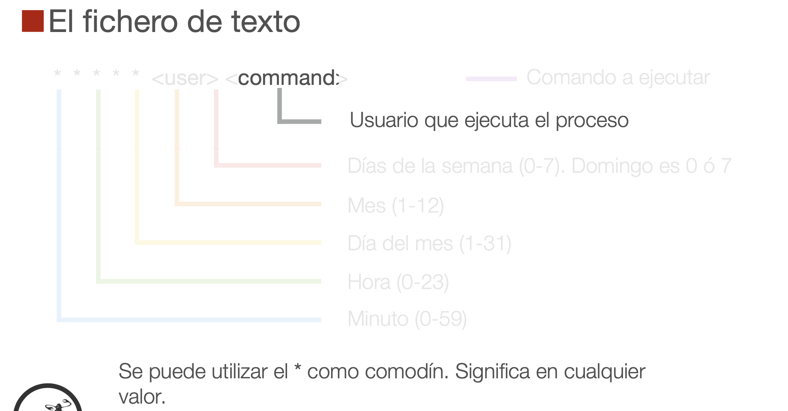

## AWS

Iniciamos con el video **1.mp4**

---

**trucos**

* `Ctrl+r` : es un buscador de comandos antiguos, has de decirle las palabras que quieres buscar
* `sudo !!` : cuando te olvidas poner sudo en el comando, esto te permite ejecutar ell mismo comando que antes con sudo delante


```sh
Despliegue_AWS ls
    web15.pem

# usuario de acceso con ip
Despliegue_AWS ssh ubuntu@54.224.151.83
    "The authenticity of host '54.224.151.83 (54.224.151.83)' can't be established.
    ED25519 key fingerprint is SHA256:18BE2tcCHLs3H3pAK3aRXblKUhQ56RXbHu8KKBVN/ZM.
    This key is not known by any other names.
    Are you sure you want to continue connecting (yes/no/[fingerprint])? yes
    Warning: Permanently added '54.224.151.83' (ED25519) to the list of known hosts.
    ubuntu@54.224.151.83: Permission denied (publickey)."

# se ha guardado laprimera vez esta huella: SHA256:18BE2tcCHLs3H3pAK3aRXblKUhQ56RXbHu8KKBVN/ZM
Despliegue_AWS ssh ubuntu@54.224.151.83
    ubuntu@54.224.151.83: Permission denied (publickey).

Despliegue_AWS ssh -i web15.pem ubuntu@54.224.151.83
    @@@@@@@@@@@@@@@@@@@@@@@@@@@@@@@@@@@@@@@@@@@@@@@@@@@@@@@@@@@
    @         WARNING: UNPROTECTED PRIVATE KEY FILE!          @
    @@@@@@@@@@@@@@@@@@@@@@@@@@@@@@@@@@@@@@@@@@@@@@@@@@@@@@@@@@@
    Permissions 0644 for 'web15.pem' are too open.
    It is required that your private key files are NOT accessible by others.
    This private key will be ignored.
    Load key "web15.pem": bad permissions
    ubuntu@54.224.151.83: Permission denied (publickey).

# protejemos el archivo
Despliegue_AWS chmod 600 web15.pem 

    Welcome to Ubuntu 22.04.3 LTS (GNU/Linux 6.2.0-1017-aws x86_64)

    * Documentation:  https://help.ubuntu.com
    * Management:     https://landscape.canonical.com
    * Support:        https://ubuntu.com/advantage

    System information as of Tue Feb  6 14:30:07 UTC 2024

    System load:  0.00146484375     Processes:             95
    Usage of /:   20.5% of 7.57GB   Users logged in:       0
    Memory usage: 21%               IPv4 address for eth0: 172.31.39.104
    Swap usage:   0%

    Expanded Security Maintenance for Applications is not enabled.

    0 updates can be applied immediately.

    Enable ESM Apps to receive additional future security updates.
    See https://ubuntu.com/esm or run: sudo pro status


    The list of available updates is more than a week old.
    To check for new updates run: sudo apt update


    The programs included with the Ubuntu system are free software;
    the exact distribution terms for each program are described in the
    individual files in /usr/share/doc/*/copyright.

    Ubuntu comes with ABSOLUTELY NO WARRANTY, to the extent permitted by
    applicable law.

    To run a command as administrator (user "root"), use "sudo <command>".
    See "man sudo_root" for details.

ubuntu@ip-172-31-39-104:~$ 

# para cerrar --> ubuntu@ip-172-31-39-104:~$ logout 
```

```sh
ubuntu@ip-172-31-39-104:~$ pwd
    /home/ubuntu

# ¿quien está conecta al servidor?
ubuntu@ip-172-31-39-104:~$ who
ubuntu   pts/0        2024-02-06 14:30 (77.243.86.2)

# creo archivo hello
ubuntu@ip-172-31-39-104:~$ touch hello
ubuntu@ip-172-31-39-104:~$ ls
    hello

# los archivos ocultos en formato lista
ubuntu@ip-172-31-39-104:~$ ls -l /
    total 64
    lrwxrwxrwx   1 root root     7 Dec  7 02:10 bin -> usr/bin
    drwxr-xr-x   4 root root  4096 Dec  7 02:15 boot
    drwxr-xr-x  15 root root  3200 Feb  6 12:31 dev
    drwxr-xr-x  93 root root  4096 Feb  6 12:31 etc
    drwxr-xr-x   3 root root  4096 Feb  6 12:31 home
    lrwxrwxrwx   1 root root     7 Dec  7 02:10 lib -> usr/lib
    lrwxrwxrwx   1 root root     9 Dec  7 02:10 lib32 -> usr/lib32
    lrwxrwxrwx   1 root root     9 Dec  7 02:10 lib64 -> usr/lib64
    lrwxrwxrwx   1 root root    10 Dec  7 02:10 libx32 -> usr/libx32
    drwx------   2 root root 16384 Dec  7 02:13 lost+found
    drwxr-xr-x   2 root root  4096 Dec  7 02:10 media
    drwxr-xr-x   2 root root  4096 Dec  7 02:10 mnt
    drwxr-xr-x   2 root root  4096 Dec  7 02:10 opt
    dr-xr-xr-x 158 root root     0 Feb  6 12:31 proc
    drwx------   4 root root  4096 Feb  6 12:31 root
    drwxr-xr-x  25 root root   860 Feb  6 14:30 run
    lrwxrwxrwx   1 root root     8 Dec  7 02:10 sbin -> usr/sbin
    drwxr-xr-x   8 root root  4096 Dec  7 02:17 snap
    drwxr-xr-x   2 root root  4096 Dec  7 02:10 srv
    dr-xr-xr-x  13 root root     0 Feb  6 12:31 sys
    drwxrwxrwt  11 root root  4096 Feb  6 12:32 tmp
    drwxr-xr-x  14 root root  4096 Dec  7 02:10 usr
    drwxr-xr-x  13 root root  4096 Dec  7 02:13 var

ubuntu@ip-172-31-39-104:~$ pwd
/home/ubuntu

ubuntu@ip-172-31-39-104:~$ cd ..
ubuntu@ip-172-31-39-104:/home$ ls
    ubuntu
ubuntu@ip-172-31-39-104:/home$ ls -l /
    total 64
    lrwxrwxrwx   1 root root     7 Dec  7 02:10 bin -> usr/bin
    drwxr-xr-x   4 root root  4096 Dec  7 02:15 boot
    drwxr-xr-x  15 root root  3200 Feb  6 12:31 dev
    drwxr-xr-x  93 root root  4096 Feb  6 12:31 etc
    drwxr-xr-x   3 root root  4096 Feb  6 12:31 home
    lrwxrwxrwx   1 root root     7 Dec  7 02:10 lib -> usr/lib
    lrwxrwxrwx   1 root root     9 Dec  7 02:10 lib32 -> usr/lib32
    lrwxrwxrwx   1 root root     9 Dec  7 02:10 lib64 -> usr/lib64
    lrwxrwxrwx   1 root root    10 Dec  7 02:10 libx32 -> usr/libx32
    drwx------   2 root root 16384 Dec  7 02:13 lost+found
    drwxr-xr-x   2 root root  4096 Dec  7 02:10 media
    drwxr-xr-x   2 root root  4096 Dec  7 02:10 mnt
    drwxr-xr-x   2 root root  4096 Dec  7 02:10 opt
    dr-xr-xr-x 155 root root     0 Feb  6 12:31 proc
    drwx------   4 root root  4096 Feb  6 12:31 root
    drwxr-xr-x  25 root root   860 Feb  6 14:30 run
    lrwxrwxrwx   1 root root     8 Dec  7 02:10 sbin -> usr/sbin
    drwxr-xr-x   8 root root  4096 Dec  7 02:17 snap
    drwxr-xr-x   2 root root  4096 Dec  7 02:10 srv
    dr-xr-xr-x  13 root root     0 Feb  6 12:31 sys
    drwxrwxrwt  11 root root  4096 Feb  6 12:32 tmp
    drwxr-xr-x  14 root root  4096 Dec  7 02:10 usr
    drwxr-xr-x  13 root root  4096 Dec  7 02:13 var
```

**SISTEMA DE FICHEROS**

* **/etc** : ficheros de configuración del sistema
* **/etc/init.d/** : Scripts que se ejecutan cuando arranca el sistema en
* **/etc/rc.d/** : Scripts que se ejecutan cuando arranca el sistema en
* **/home y /rooT** : ficheros de configuración del sistema
  - **/home/goku** : usuario del sistema
  - **/home/vegeta** : usuario del sistem
* **/root** : es la casa de root (superadministrador)
* **/sbin** : ejecutables de comandos  --> los programas
* **/tmp** : almacenar datos, serán eliminados cuando el sistema se reinicio o necesite espacio
* **/usr/bin**: ejecutables para cualquier usuario
* **/usr/lib**: librerías de programación (C/C++ habitualmente)
* **/usr/local**: archivos locales (desarrollados por ti)
* **/usr/sbin**: ejecutables sólo para administradores
* **/usr/share**: datos compartidos (documentación)
* **/usr/src**: código fuente del kernel de Linux
* **/var/log**: archivos de log
* **/var/mail**: buzones de e-mail de los usuarios
* **/var/run**: descriptores de procesos o sockets
* **/var/www**: archivos servidos por el servidor web

**JUGANDO CON ARCHIVOS Y DIRECTORIOSs**

* **mkdir `<foldername>`** : Crear un directorio
* **rmdir `<foldername>`** : Elimina recursivamente directorios y archivos.
* **rm -rf `<foldername>`** : PELIGRO: rm -rf / como root borraría todo el disco 
* **touch `<filename>`** : Crear un archivo vacío
* **nano `<filename>`** : Editar un archivo
* **vi `<filename>`**: Editar un archivo
* **cat `<filename>`** : Muestra el contenido de un fichero (ideal para archivos pequeños)
* **more `<filename>`** : Permite leer un fichero grande poco a poco
* **head `<filename>`** : Muestra las primeras líneas del fichero
* **tail `<filename>`** : Muestra las últimas líneas del fichero
* **tail -f `<filename>`** : Muestra en tiempo real el último contenido del fichero
* **wc `<filename>`** : Cuántas palabras tiene un archivo de texto
* **wc -l `<filename>`** : Cuántas líneas tiene un archivo de texto
* **diff `<file1> <file2>`** : Muestra las diferencias entre dos archivos
* **sort `<filename>`** : Ordena las líneas de un archivo de texto
* **grep `<filename> <query>`** : Filtra contenidos. Busca <query> en <filename>. Permite expresiones regulares.
* **cp `<source> <target>`** : Copia un archivo de un sitio a otro
* **mv `<source> <target>`** : Mueve o renombra un archivo
* **rm `<filename>`** : Eliminar un archivo
* **rm -f `<filename>`** : Para que no pregunte si estamos seguros de eliminar
* **ln `<source> <target>`** : Crea un alias del archivo. Si eliminamos el alias se elimina el archivo.
* **ln -s `<source> <target>`** : Crea un acceso directo. Si eliminamos el acceso directo, NO elimina el archivo. También conocido como enlace simbólico.

---

https://www.tecmint.com/35-practical-examples-of-linux-find-command/

* **find . -name `<filename>`** : Busca un archivo de nombre filename en el directorio actual y subdirectorios.
* **find / -name `<filename>`** : Busca un archivo de nombre filename en todo el sistema
* **man `<command name>`** : Muestra el manual del programa o comando

**USUARIOS GRUPOS Y PERMISOS**

**Usuarios y grupos**

* Linux es un sistema multiusuario
* Los usuarios no sólo son personas, también pueden ser servicios
(como el servidor web, servidor de correo, etc.)
* Las cuentas de usuario, pueden pertenecer a uno o varios grupos
* Hay unos grupos especiales de administrador (admin o sudo)
* Suele haber una cuenta de super-administrador: root
* En Ubuntu, el login con root está deshabilitado por seguridad

**Permisos de archivos**

* Cada archivo o carpeta pertenece a un usuario y un grupo
* Los permisos de Linux permiten definir tres tipos de acceso:
   - Lectura
   - Escritura y/o borrado
   - Ejecución (para archivos o scripts ejecutables)
* Estos tres tipos de acceso, se definen en tres niveles:
   - Propietario del archivo o carpeta
   - Usuarios del mismo grupo del archivo o carpeta
   - Otros usuarios fuera del grupo


**Modificar permisos de archivos y carpeta**

* **chmod `<target>`±rwx `<filename>`**
    - `<target>` = a / u / g / o
    - a = all / u = user/owner / g = group / o = other
* **chmod u+wrx backup** : Da (+) todos (rwx) los permisos para el propietario (u)
* **chmod a+x backup** : Da (+) permisos de ejecución (x) para todos (a)
* **chmod g+rx backup**: Da (+) permisos de lectura y ejecución (rx) a los usuarios del grupo (g)
* **chmod o-rw backup**: Quita (-) permisos de lectura y escritura (rw) a los otros usuarios (o)

* **adduser <username>** : Crear un usuario y un grupo con el mismo nombre del usuario y mete al usuario en dicho grupo. Esto lo registra en /etc/passwd y /etc/group


**Ejecutando como administrador**

* **sudo `<command>`** : Ejecuta lo que viene seguido de sudo como administrador. El usuario debe tener permiso de sudoer.
* **deluser `<username>`** : Elimina un usuario del sistema. Lo elimina de /etc/passwd
* **addgroup `<groupname>`** : Crea un grupo añadiéndolo a /etc/group
* **delgroup `<groupname>`** : Elimina un grupo de /etc/group No elimina los usuarios de ese grupo
* **adduser `<username> <groupname>`** : Añade el usuario al grupo en /etc/group
* **adduser `<username>` sudo** : Añade el usuario al grupo sudo en /etc/group Si eres sudo, tienes permisos para todo, da igual los permisos del archivo
* **chown `<newowner> <filename>`** : El archivo <filename> pasa a pertenecer a <newowner>
* **chown -R `<newowner> <foldername>** : Cambiar el propietario de <foldername> y todos sus archivos y subdirectorios. Es un cambio recursivo (-R)
* **chgrp `<newgroup> <filename>`** : El archivo <filename> pasa a pertenecer a <newgroup>
* **chgrp -R `<newgroup> <foldername>`** : Cambiar el grupo de <foldername> y todos sus archivos y subdirectorios. Es un cambio recursivo (-R)
* **chown `<user>:<group> <filename>`** : Cambiar el propietario y grupo a la vez
* **passwd `<username>`** : Cambiar contraseña de un usuario


**Apagar y reiniciar** En necesario que seas administrador o sudoer

* **shutdown** :  Apaga el servidor
* **reboot** : Reiniciar el servidor


**Instalando y desinstalando software**

Gestor de paquetes `apt-get`

En las distribuciones basadas en Debian (como Ubuntu), se puede instalar y desinstalar software a través del gestor de paquetes:`apt-get`
Este gestor se descarga paquetes ya compilados desde Internet para tu distribución y los instala en el sistema (descargando también otras dependencias si hiciera falta).

* **apt-get install `<package>`** : Instala el paquete `<package>` en el sistema
* **apt-get purge `<package>`** : Desinstala el paquete `<package>` del sistema
* **apt-get update** : Actualiza los repositorios de software para buscar actualizaciones
* **apt-get upgrade** : Instala todas las actualizaciones de paquetes


**Gestión de procesos**


* **top** [top: el CTRL+ALT+SUPR de Linux] : Muestra en tiempo real información de los los procesos ordenados por consumo de CPU (de mayor a menor). Para salir, pulsar la letra Q (de quit)
* **ps aux** : Muestra todos los procesos en ejecución con mucha información (no sólo los que más CPU consumen, com hace top)
* **ps aux | more** : Para poder ir viéndolos poco a poco
* **ps aux | grep `<command>`** : Para buscar un processo <command>
* **kill `<pid>`** : Mata el proceso número <pid>. Sólo vale para procesos nuestros.
* **sudo kill `<pid>`** : Para poder matar procesos de otros usuarios


**Gestionando el espacio en disco**

* **df** : Muestra el espacio libre de las particiones en bytes
* **df -h** : Muestra el espacio libre legible para humanos (h)
* **du `<folder>`** : Muestra lo que ocupa cada archivo dentro de `<folder>`
* **du -ch `<folder>`** : Más rápido (c) y entendible para humanos (h)


**Seguridad**

Consejos de seguridad

* Cambiar las contraseñas como mucho trimestralmente
* Cambia los puertos por defecto de los servicios que puedas
* Oculta los números de versión de los servicios
* Protege con SSL y autenticación HTTP los accesos de
administración de tus plataformas
* No uses /admin /adm /cms /backend /backoffice (sé original)
* Usa un firewall
* Haz copias de seguridad diarias...y haz ensayos de recuperación
* Mantén actualizado tu software
* Elimina los humanos: son la mayor brecha de seguridad


`fail2ban`

* Es un servicio que se encarga de proteger el sistema sobre ataques a diferentes servicios mediante monitorización de los logs (entre otros aspectos).
* Cuando detecta una amenaza, reacciona baneando la IP del posible atacante.
* A veces se pasa de protector y nos deja sin acceso a nosotros
* Es muy sencillo de configurar

Instalación `fail2ban`

```sh
sudo apt-get install fail2ban
```

* **`/etc/fail2ban/jail.conf`** : Fichero de configuración
* **`/etc/fail2ban/filter.d/`** : Configuración de filtros y acciones


**Comprimir y descomprimir**

Hay varias opciones, pero lo más habitual es usar tar + gzip:

* tar es un comando que empaqueta (junta varias carpetas en un archivo) pero no comprime
* gzip es un comando que comprime archivos (similar a zip)
* Se utiliza tar con la opción -z para comprimir en gzip
* También podemos usar zip, pero en Linux se usa mas .tar.gz

* **tar -czvf `<foo>`.tar.gz `<folder>`** : Comprime el directrorio <folder> en un archivo <foo>.tar.gz
* **tar -xzvf `<foo>`.tar.gz** : Descomprime <foo>.tar.gz en el directorio local
* **zip -r `<foo>`.zip `<folder>`** : Comprime el directrorio <folder> en un archivo <foo>.zip ACHTUNG: zip no suele venir instalado en Linux.
* **unzip <foo>.zip** : Descomprime el archivo <foo>.zip en el directorio actual. ACHTUNG: unzip no suele venir instalado en Linux.


**Redirección** 


En Bash podemos redirigir la salida de los comandos para que, en lugar de mostrarnos el resultado por pantalla, nos lo almacenen en un fichero. También podemos redirigir la entrada, para que un comando en lugar de esperar un dato por pantalla (o teclado) directamente lo tome de un fichero.


* **echo “hi” > hello.txt** : Guarda la salida del comando “echo” en el fichero “hello.txt”. Si el fichero existe, machaca su contenido.
Si no existe el fichero, lo crea.
* **echo “hi” >> hello.txt** : Igual que el anterior, pero: Si el fichero existe, añade el contenido al final. Si no existe el fichero, lo crea.
* **patch index.js < v1.patch** : Pasa el contenido de “hello.txt” como argumento al comando hello.


**Pipes**

Los pipes nos permiten pasar la información de un comando a otro como si fueran filtros. La salida de un comando se transforma en la entrada de otro comando.

* `cat quixote.txt | grep Rocinante | wc -l` : cat saca todo el contenido del fichero “quixote.txt” y se lo pasa como entrada al comando “grep Rocinante” que filtrará las líneas en las que aparece la palabra “Rocinante” y éste le pasa dicho resultado al comando “more” que nos permite ir leyendo poco a poco los resultados.


> [!NOTE]
> Repositorio de comandos:  http://www.commandlinefu.com/


## Scripting

* La bash permite almacenar comandos en un fichero de texto y ejecutarlos como si fuera programas.
* Proporciona incluso instrucciones de control de flujo y bucles
* Los ficheros deben tener permisos de ejecución para poder ser
tratados como programas.
* En la primera línea, se ha de indicar cuál es el intérprete que se
debe utilizar.
* Podemos utilizar otros lenguajes de scripting (python, php, perl...)

```sh
#!/bin/bash
# This is a comment
echo “My command is called $0\n” echo “The first argument is $1\n” for item in ‘$(ls)’
do
echo “- $item\n” done
```

```sh
#!/bin/bash para scripts bash o shellscript 
#!/bin/python para scripts python 
#!/bin/php para scripts php
```

**Variables implícitas** 

* **$@** lista de parámetros recibida por el comando
* **$0** nombre del propio comando/archivo
* **$1** primer parámetro
* **$2** segundo parámetro
...
* **$n** n-ésimo parámetro
* **`$?`** resultado de la salida del último comando (0 es OK, !=0 es KO) $$ número de proceso que se ejecuta
* **$#** número de parámetros recibidos por el comando


```sh
# Definición de variables
name=“hello” 
counter=0
```

```sh
# Uso de variables
echo “Hello $name” 
echo “Hello ${name}” 
echo “$counter times” 
echo “${counter} times”
```

```sh
# Usando la salida de un comando
files=$(ls) # Ejecuta el comando ls y guarda su salida en “files” 
echo $files
```


```sh
# Condicionales

if <condition> then
<stuff>
else
<otherstuff>
fi
```


```sh
# Condiciones de las condicionales

if cp $source $target # si se ejecuta bien cp
if test -f $source # si $source es un fichero
if [ -f “$source” ] # si $source es un fichero
if [ -d “$source” ] # si $source es un directorio if [ -e “$source” ] # si $source existe
if $source = $target # si $source es igual a $target
if $source != $target # si $source es distinto a $target
```

```sh
# Condiciones de las condicionales: numéricas

if $numA -eq $numB # $numA == $numB 
if $numA -ne $numB # $numA != $numB 
if $numA -ge $numB # $numA >= $numB 
if $numA -gt $numB # $numA > $numB 
if $numA -le $numB # $numA <= $numB 
if $numA -lt $numB # $numA < $numB
```

```sh
# Case

case <variable> in <value1>)
<stuff>
;;
<value2> | <value3>)
<otherstuff>
;; *)
;; esac
```

```sh
# Bucle for

for file in $(ls) 
do
    <stuff>
done
```

**Salida**

Cuando nuestro programa acaba bien, debe devolver `exit 0`. Si algo va mal, deberemos devolver un número distinto de cero (lo suyo es diferenciar los tipos de error con números).

```sh
# Funciones

function <name> ()
{
    <commands>
    return <int>
}
```


**Ejecutar en background**

* **`<command>` &** : Ejecutar en background sin deconexión

ACHTUNG: No vale para ejecutar en segundo plano y desconectarnos. El sistema puede matar el proceso pasado un tiempo.

* **nohup `<command>` &** : Ejecutar en background con desconexión. La posible salida que pueda sacar el comando, la almacenará en un archivo llamado nohup.out


**Programando tareas automáticas**


El cron

* Todos los sistemas Linux incluyen un programador de tareas: cron
* Nos permite programar comandos que se ejecuten automáticamente
* Básicamente, se almacena en un fichero la información de programación y el comando a ejecutar
* Como máximo podemos ejecutar repetitivamente hasta una vez por minuto


**Programando tareas para mi usuario**

* **crontab -e** : 


* **sudo nano /etc/crontab** : Programando tareas de sistema





**Ejemplo crontab -e**

* `30 10 * * 1 /usr/bin/who >> /home/who.txt` : Todos los lunes a las 10:30
* `0,30 * * * 1 /usr/bin/who >> /home/who.txt`: Todos los lunes a en punto o a y media de todas las horas
* `*/15 * * * * /usr/bin/who >> /home/who.txt` : Cada 15 minutos
* `30 21 * * 6 /sbin/shutdown -h now` : Apaga el servidor los sábados a las 21:30. Sólo lo podría hacer root.

https://es.wikipedia.org/wiki/Cron_(Unix)

**Ejemplo /etc/crontab** 


* `30 10 * * 1 larry /usr/bin/who >> /home/who.txt` : Todos los lunes a las 10:30
* `0,30 * * * 1 steve /usr/bin/who >> /home/who.txt` : Todos los lunes a en punto o a y media de todas las horas
* `*/15 * * * * sergei /usr/bin/who >> /home/who.txt` : Cada 15 minutos
* `30 21 * * 6 root /sbin/shutdown -h now` : Apaga el servidor los sábados a las 21:30. Sólo lo podría hacer root.

